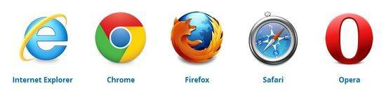
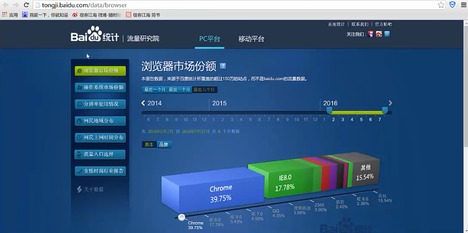
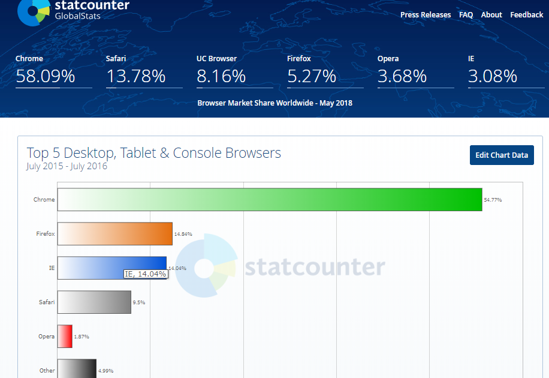
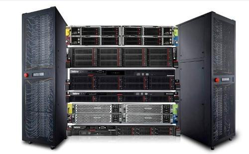
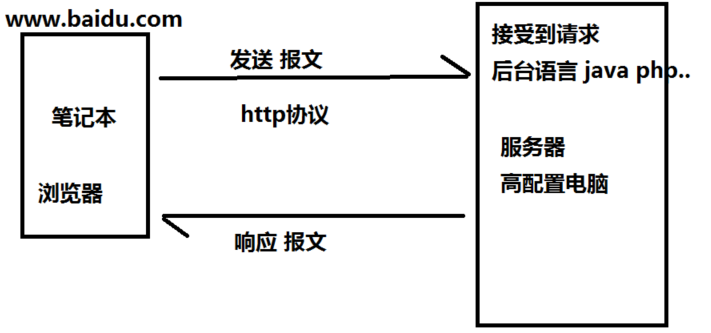
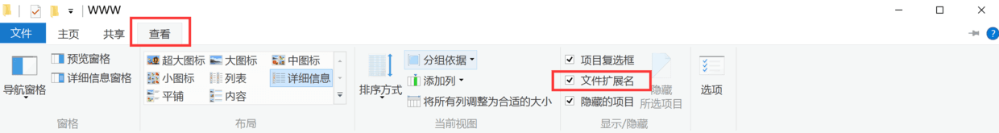
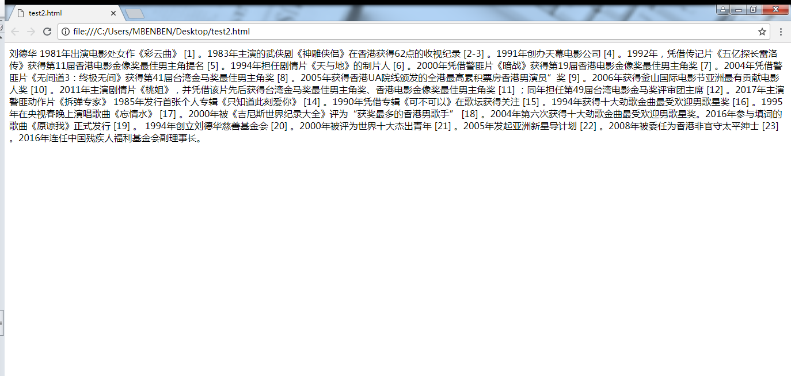
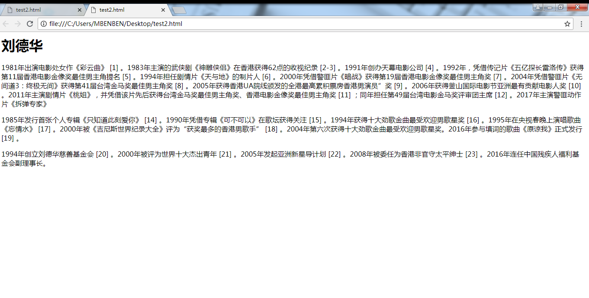
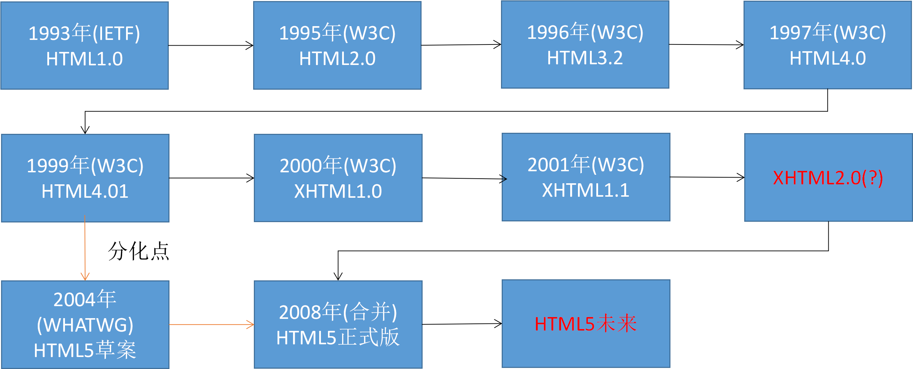
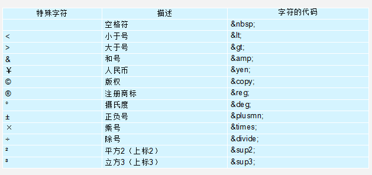

# Web前端开发基础--基本概念

 

## 什么是浏览器

\- 浏览器是安装在电脑里面的一个软件， 能够让将网页内容呈现给用户查看，并让用户与网页交互的一种软件。 就好比QQ一样都是安装在电脑里面的一个软件， 只不过功能不同而已
\- 常见主流浏览器







\- 不同的浏览器有不同的浏览器内核， 浏览器内核也就是浏览器所采用的渲染引擎，渲染引擎决定了浏览器如何显示网页的内容，从而导致了浏览器兼容性问题出现
\- IE内核 Trident
\- 谷歌内核 WebKit / Blink
\- 火狐内核 Gecko
\- Safarri内核 WebKit
\- 欧朋内核 Presto
\- 前期上课以后面谷歌浏览器为主，后面将专门详细介绍浏览器兼容问题

## 什么是服务器


\- 服务器也是电脑，只不过是比我们的电脑配置更高的电脑，并且24小时不断电，不关机的计算机
\- 服务器是专门用于存储数据电脑， 访问者可以访问服务器**获得**服务器上存储的资源
\- 服务器一旦关机，访问者就无法访问




### 浏览器请求数据的过程

- 1.按下回车时浏览器根据输入的URL地址发送`请求报文`

- 2.服务器接收到请求报文，会对`请求报文`进行处理

- 3.服务器将处理完的结果通过`响应报文`返回给浏览器

- 4.浏览器`解析服务器返回的结果`，将结果显示出来

  - 

    

    

- 请求过程验证

  - 1.利用chome浏览器打开一个网页
  - 2.打开开发人员工具
  - 3.打开Network查看请求报文和响应报文 
    - 3.1请求报文
    - 一个HTTP请求报文由请求行（request line）、请求头部（header）、空行和请求数据4个部分

  - 3.2响应报文
  - 一个HTTP响应报文由响应行、响应头、响应体组成

  

------

## 什么是URL

- 1.我们在浏览器的地址栏中输入的地址其实就是URL
- 2.URL格式：
  - 127.0.0.1/demo/test.html （浏览器会自动补全http:和：80）
  -  [http://127.0.0.1/demo/test.html （浏览器会自动补全：80）
  -  [http://127.0.0.1:80/demo/test.html（完整格式）
  - 协议类型://ip地址:端口号/资源路径/资源名称
- 3.URL拆分
  - 网络协议类型 http:// 
  - 服务器IP地址 127.0.0.1
  - 服务器端口号 :80
  - 资源路径 网页在服务器上的路径
  - 资源名称 index.html
- 4.URL拆分后每一部分的作用
- 4.1服务器IP地址 和 服务器端口号它们两的作用：
  - 告诉浏览器要去什么地方才能找到对应的服务器， 也就是告诉浏览器服务器的详细地址
  - 服务器IP地址相当于现实生活中的地址； 
  - 服务器端口号相当于现实生活中的门牌号码； 
  - 那么如果将地址和门牌号码结合在一起， 就是我的详细地址

- 4.2资源名称它的作用：
  - 告诉服务器我需要获取哪一个文件
- 4.3资源名称
  - 需要访问的文件名称
- 5.补充
  -  互联网上的每一个资源都有一个唯一的URL地址
  - 由于IP地址全都是数字， 没有任何的含义，比较难以记忆。 所以在访问网页时最常见的不是IP地址而是“域名”（一串有含义的字母OR数字）

------

## 什么是HTTP协议

- 1.HTTP是Hypertext Transfer Protocol的缩写, 超文本传输协议
- 2.什么是协议?
  - 在现实生活中有很多的协议, 例如租房协议/买卖协议/离婚协议
  - 无论是什么协议他们都是一个共同点, 就是用来规范/约束某一类事物
- 3.沟通问题?
  - 沟通最常见的问题就是语言不通, 例如中国人和美国人沟通, 一个人说中文, 一个人说英文, 如果两个人都不懂中文或者英文, 那么就会出现沟通问题
  - 如果要想解决沟通文件, 是不是需要先拟定规定, 两个人都说中文, 或者两个人都说英文, 或者请一个既懂中文又懂英文的翻译
- 4.HTTP协议是用来规范/约束哪一类事物?
  - 浏览器访问网页其实就是去服务器请求数据, 所以浏览器需要和服务器沟通, 所以也会存在沟通问题
  - HTTP协议就相当于我们让两个人都说中文或者都说英文一样, 就是提前规范两个人之间如何沟通, 也就是规范/约束浏览器和服务器之间如何沟通

## 其他知识储备

· 在Windows系统中如何查看文件的扩展名

o 默认情况下Windows系统是不显示文件的扩展名的, 但是作为一个开发者而言, 查看文件的扩展名是我们的必备技能

o win10: 随便打开一个文件夹-->点击查看-->将文件扩展名的选项勾选上



Html文件（网页）的扩展名是.html

· 电脑上的一个文件是可以"同时"被多个软件打开的, 不同的软件打开可能会有不同的效果

o 例如: 同一个test.html文件可以被多个浏览器和记事本一起打开

o 例如: .html文件通过浏览器打开不可以编辑, 通过记事本打开可以编辑

· 什么是纯文本文件?

o 我们Windows电脑上有一款默认安装好的软件叫做记事本. 这款软件就是专门用来打开纯文本文件的, 所以只要能够被记事本打开, 并且能够正常显示的文件都是纯文本文件

o .html的文件可以被记事本打开, 并且能够正常显示,所以.html文件是一个纯文本文件

## 什么是HTML

· HTML其实是HyperText Markup Language的缩写, 超文本标记语言

## HTML的作用

· 1.首先利用记事本保存了一个标题和两段描述, 然后修改纯文本文件的扩展名为.html, 然后再利用浏览器打开

· 刘德华

· 1981年出演电影处女作《彩云曲》 [1]  。1983年主演的武侠剧《神雕侠侣》在香港获得62点的收视纪录 [2-3]  。1991年创办天幕电影公司 [4]  。1992年，凭借传记片《五亿探长雷洛传》获得第11届香港电影金像奖最佳男主角提名 [5]  。1994年担任剧情片《天与地》的制片人 [6]  。2000年凭借警匪片《暗战》获得第19届香港电影金像奖最佳男主角奖 [7]  。2004年凭借警匪片《无间道3：终极无间》获得第41届台湾金马奖最佳男主角奖 [8]  。2005年获得香港UA院线颁发的全港最高累积票房香港男演员”奖 [9]  。2006年获得釜山国际电影节亚洲最有贡献电影人奖 [10]  。2011年主演剧情片《桃姐》，并凭借该片先后获得台湾金马奖最佳男主角奖、香港电影金像奖最佳男主角奖 [11]  ；同年担任第49届台湾电影金马奖评审团主席 [12]  。2017年主演警匪动作片《拆弹专家》

· 1985年发行首张个人专辑《只知道此刻爱你》 [14]  。1990年凭借专辑《可不可以》在歌坛获得关注 [15]  。1994年获得十大劲歌金曲最受欢迎男歌星奖 [16]  。1995年在央视春晚上演唱歌曲《忘情水》 [17]  。2000年被《吉尼斯世界纪录大全》评为“获奖最多的香港男歌手” [18]  。2004年第六次获得十大劲歌金曲最受欢迎男歌星奖。2016年参与填词的歌曲《原谅我》正式发行 [19]  。

· 1994年创立刘德华慈善基金会 [20]  。2000年被评为世界十大杰出青年 [21]  。2005年发起亚洲新星导计划 [22]  。2008年被委任为香港非官守太平绅士 [23]  。2016年连任中国残疾人福利基金会副理事长。

· 2.打开之后发现显示的格式不对, 不对的原因是因为在纯文本文件中所有文字都是同级别的, 浏览器不知道哪些文字代表什么意思. 也就是浏览器不知道哪些文字是标题, 哪些文字是段落...., 所以导致了显示的格式不正确



· 正是因为如此, 所以HTML应用而生. HTML就只有一个作用, **它是专门用来描述文本的语义的**. 也就是说我们可以利用HTML来告诉浏览器哪些是标题, 哪些是段落.

o 这些用于描述其它文本语义的文本, 我们称之为标签. 并且这些用于描述文本语义的标签将来在浏览器中是不会被显示出来的

o 所以正是因为HTML的这些标签是专门用来描述其它文本语义的, 并且在浏览器中不会被显示出来, 所以我们称这些文本为"超文本", 而这些文本又叫做标签, 所以HTML被称之为"超文本标记语言"

```
<h1>刘德华</h1>

<p>1981年出演电影处女作《彩云曲》 [1]  。1983年主演的武侠剧《神雕侠侣》在香港获得62点的收视纪录 [2-3]  。1991年创办天幕电影公司 [4]  。1992年，凭借传记片《五亿探长雷洛传》获得第11届香港电影金像奖最佳男主角提名 [5]  。1994年担任剧情片《天与地》的制片人 [6]  。2000年凭借警匪片《暗战》获得第19届香港电影金像奖最佳男主角奖 [7]  。2004年凭借警匪片《无间道3：终极无间》获得第41届台湾金马奖最佳男主角奖 [8]  。2005年获得香港UA院线颁发的全港最高累积票房香港男演员”奖 [9]  。2006年获得釜山国际电影节亚洲最有贡献电影人奖 [10]  。2011年主演剧情片《桃姐》，并凭借该片先后获得台湾金马奖最佳男主角奖、香港电影金像奖最佳男主角奖 [11]  ；同年担任第49届台湾电影金马奖评审团主席 [12]  。2017年主演警匪动作片《拆弹专家》</p>

<p>1985年发行首张个人专辑《只知道此刻爱你》 [14]  。1990年凭借专辑《可不可以》在歌坛获得关注 [15]  。1994年获得十大劲歌金曲最受欢迎男歌星奖 [16]  。1995年在央视春晚上演唱歌曲《忘情水》 [17]  。2000年被《吉尼斯世界纪录大全》评为“获奖最多的香港男歌手” [18]  。2004年第六次获得十大劲歌金曲最受欢迎男歌星奖。2016年参与填词的歌曲《原谅我》正式发行 [19]  。</p>

<p>1994年创立刘德华慈善基金会 [20]  。2000年被评为世界十大杰出青年 [21]  。2005年发起亚洲新星导计划 [22]  。2008年被委任为香港非官守太平绅士 [23]  。2016年连任中国残疾人福利基金会副理事长。</p>
```



· 注意事项:

o 虽然我们利用H1标签描述一段文本之后, 这段文本在浏览器中显示出来会被放大和加粗, 看上去我们是利用HTML的标签修改了被描述的那段文本的样式. 但是一定要记住, HTML只有一个作用, 它是专门用来给文本添加语义的, 而不是用来修改文本的样式的

· H1标签它的作用是什么?

o 错误: H1标签可以用来修改文字的大小, 并且还可以将文字加粗

o 正确: H1标签的作用是用来告诉浏览器, 哪些文字是标题. 也就是H1标签是专门用于给指定的文字添加标题语义的

## HTML发展史



### IETF简介

- IETF是英文Internet Engineering Task Force的缩写, 翻译过来就是"互联网工程任务组"
- IETF负责定义并管理因特网技术的所有方面。包括用于数据传输的IP协议、让域名与IP地址匹配的域名系统（DNS）、用于发送邮件的简单邮件传输协议（SMTP）等

### W3C简介

- W3C是英文World Wide Web Consortium的缩写， 翻译过来就是W3C理事会或万维网联盟,  W3C是全球互联网最具权威的技术标准化组织.
- W3C于1994年10月在麻省理工学院计算机科学实验室成立。创建者是万维网的发明者Tim Berners-Lee（蒂姆·伯纳斯-李），万维网之父、html设计者、w3c创始人
- W3C负责web方面标准的制定，像HTML、XHTML、CSS、XML的标准就是由W3C来定制的。

## 网页的固定格式

· 1.编写网页和写信一样都有一套规范和要求, 这套规范和要求中规定了写信的固定格式

· 2.写信基本结构

```
敬爱的xxx:

      您好!

      正文正文正文正文正文正文正文正文正文正文正文正文

正文正文正文正文正文正文正文正文正文正文正文正文

      此致

敬礼!

                                                              你的朋友 xx

                                                              xxxx年x月x日
```

· 3.网页基本结构:

```html
<html>

   <head>

       <title></title>

   </head>

   <body>

   </body>

</html>
```

· 4.通过观察我们发现, HTML基本结构中所有的标签都是成对出现的, 这些成对出现的标签中有一个带/有一个不带/, 那么这些不带/的标签我们称之为开始标签, 这些带/的我们称之为结束标签


**<!DOCType html>**

· 作用:

o 用于告诉浏览器这是一个网页, 也就是说告诉浏览器我是一个HTML文档

**html标签**

· 作用:

o Html文件（网页）的根标签

· 注意点:

o 其它所有的标签都必须写在html标签里面, 也就是写在html开始标签和结束标签中间

**head标签**

· 作用:

o 用于给网站添加一些配置信息

o 例如:

§ 指定网站的标题 / 指定网站的小图片

§ 添加网站的SEO相关的信息(指定网站的关键字/指定网站的描述信息)

§ 外挂一些外部的css/js文件

§ 添加一些浏览器适配相关的内容

· 注意点:

o 一般情况下, 写在head标签内部的内容都不会显示给用户查看, 也就是说一般情况下写在head标签内部的内容我们都看不到

**title标签**

· 作用:

o 专门用于指定网站的标题, 并且这个指定的标题将来还会作为用户保存网站的默认标题

· 注意点:

o title标签必须写在head标签里面

**body标签**

· 作用:

o 专门用于定义HTML文档中需要显示给用户查看的内容(文字/图片/音频/视频)

· 注意点:

o 虽然说有时候你可能将内容写到了别的地方在网页中也能看到, 但是千万不要这么干, 一定要将需要显示的内容写在body中

o 一对html标签中(一个html开始标签和一个html结束标签)只能有一对body标签

### **Html标签分类**

```
单标签   <! Doctype html>

 

双标签   <html></html>   <head></head>   <title></title>
```


### **Html标签关系分类**

```
  包含（嵌套关系）: <head> <title></title > </head >

  并列关系        :<head></head>  <body></body>
```


## **1标签**

### **１.1** **单标签**

◆注释标签    ctrl+/

<!— 	内容 -->

 

◆ 换行标签   <br />

```html
<!-- 换行标签 -->
第一段内容 <br/>第二段内容
```

◆ 水平线标签  <hr />

```html
<!-- 水平线标签 -->
 <hr/>
```

 

### **１.2** **双标签**   

### <p>文本内容</p>

```html
<!-- 水平线标签 -->
<p>这里面是一段文字内容</p>
```

```
特点：上下自动生成空白行。<br />换行不会生成空白行。
```

 

**标题标签**

**h1-h6  取值到h6**

```html
<h1>标题标签1</h1>
<h2>标题标签2</h2>
<h3>标题标签3</h3>
<h4>标题标签4</h4>
<h5>标题标签5</h5>
<h6>标题标签6</h6>
```


**文本标签**

```html
<font>文本内容</font>
```

 

**文本格式化标签**

```html
<font size="30px" color="red">font中的文字</font>
```

 **文本加粗标签   <strong></strong>   <b></b>  工作里尽量使用strong**

```html
<!-- 加粗标签 -->
<strong>加粗字体</strong> <b>加粗字体</b>
```

 

**文本倾斜标签**

<em></em>     <i></i>     工作里尽量使用em

```html
<!-- 文本斜体标签 -->
<em>斜体文字</em> <i>斜体文字</i>
```

 

**删除线标签**

**<del></del>     <s></s>   工作里尽量使用del**

```html
<!-- 删除线标签 -->
<del>斜体文字</del> <s>斜体文字</s>
```

 

**下划线标签**

<ins></ins>   <u></u>    工作里尽量ins

```html
<!-- 下划线标签 -->
<ins>斜体文字</ins> <u>斜体文字</u>
```

```
◆注意：之所以工作里使用<strong></strong>  <em></em> <del></del>

<ins></ins>  是因为更有语义化。
```


### **１.3** **图片标签**

```html

```

Src    图片的来源   必写属性

Alt    替换文本    图片不显示的时候显示的文字

Title   提示文本    鼠标放到图片上显示的文字

Width  图片宽度

Height  图片高度

◆图片没有定义宽高的时候，图片按照百分之百比例显示，如果只更改图片的宽度或者高度，图片等比例缩放。

## **２** **路径**

### **２.1** **相对路径**

相对于文件自身出发，就是相对路径。

◆文件和图片（html文档）在同一个目录(文件夹) ，直接写文件名。

```html

```

 

◆图片（html文档）在文件在下一级目录里。文件夹名称+/+图片（html）名称

```html

```

◆图片（html）在文件的上一级目录里，..+/+图片（html）名称

```html

```

◆图片在文件的上一级的其他目录里，../文件夹名称/图片名称

```html

```

★总结：找到下一级目录（文件夹）的图片（文件）用 /

​        跳出当前目录使用../

### **２.2** **绝对路径**

```html

```


## **３** **超链接**

指单击链接，就会跳转到链接指向的页面的链接，当然超链接也是可以链接图片，程序，甚至音乐，影像等非页面的元素的

```html
<!-- 超链接标签 -->
<a href="02.html" title="图片标签" target="_self">超链接</a>
```

href   去往的路径（跳转的页面） 必写属性

title    提示文本   鼠标放到链接上显示的文字

target=”_self”    默认值    在自身页面打开（关闭自身页面，打开链接页面）  

target=”_blank”   打开新页面 （自身页面不关闭，打开一个新的链接页面）

### **３.1** **锚链接**

1.先定义一个锚点

```html
<p id="sd">p中内容</p>
```

2.超链接到锚点

   

```html
<a href="#sd">回到顶部</a>
```


### **３.2** **空链  不知道链接到那个页面的时候，用空链**

```html
<a href="#"></a>
```


## **４** **另存为   ctrl+shift+s**

## **５** **特殊字符**



 

## **６** **列表**

### **６.1** **无序列表**

```
<ul>

<li></li>    列表项

<li></li>

<li></li>

</ul>
```

```html
<ul type="circle">

    <li>列表项</li>   

    <li>列表项</li>

    <li>列表项</li>

</ul>
```

type=”square”      小方块

Type=”disc”       实心小圆圈

Type=”circle”      空心小圆圈

### **６.2** **有序列表**

```
<ol>

<li></li>    列表项

<li></li>

<li></li>

<li></li>

<li></li>

</ol>
```

```html
<ol type="1" start="3">

    <li>列表项</li>    

    <li>列表项</li>

    <li>列表项</li>

    <li>列表项</li>

    <li>列表项</li>

</ol>
```

◆type=”1,a,A,i,I” type的值可以为1,a,A,i,I

start=”3”  决定了开始的位置。

### **６.3** **自定义列表**

```
<dl>

 <dt></dt>    小标题

  <dd></dd>   解释标题

  <dd></dd>   解释标题

</dl>
```

```html
<!-- 自定义列表 -->
<dl>

 <dt>小标题</dt>    

  <dd>解释标题</dd>   

  <dd>解释标题</dd>   

</dl>
```


## **７** **音乐标签**

注意:此标签是h5 特有的,老版本不支持

```html
<!-- 音乐标签 -->
<embed src="1.mp3" hidden="true">
```

## 8 Charset   编码

Ascll

Ansi			扩展的ASCII编码

Unicode		日文/韩文

Gbk			中文

Gb2312		中文

Big5			繁体

Utf-8			通用字符集

### 9 关键字

作用: 告诉搜索引擎当前网页的关键词, 在SEO中非常重要, 能够提高搜索命中率, 让别人更容易找到你

```html
<!-- 关键字 -->
<meta name="keywords" content="新闻,时事,时政,国际,国内,社会,法治,聚焦,评论,文化,教育,新视点,深度,网评,专题,环球,传播,论坛,图片,军事,焦点,排行,环保,校园,法治,奇闻,真情">
```

### 10 网页描述

作用: 告诉搜索引擎当前网页的主要内容, 在SEO中非常重要, 当别人在搜索引擎中搜索到你的网站时会自动作为对你网站的描述信息展示给用户, 能够提高搜索命中率, 让别人更容易找到你

```html
<!-- 网页描述 -->
<meta name="description" content="新浪网新闻中心是新浪网最重要的频道之一，24小时滚动报道国内国际及社会新闻。每日编发新闻数以万计。">
```

### 11 网页重定向

```html
<!-- 网页重定向 -->
<meta http-equiv="refresh" content="5;http://www.baidu.com"> 
```

### 12 链接外部样式表(css)

```html
<!-- 链接外部样式表文件 -->
<link rel="stylesheet" href="1.css">
```

### 13 设置icon图标

```html
<!-- icon图标 -->
<link rel = "icon" href="favicon.ico">
```

## 14 **表格**

展示数据。 是对网页重构的一个有益补充。


~~~html
<table>    		表格
```
<table>	
	<tr>       	行
        <td></td> 列

        <td></td>

        <td></td>

	</tr>
</table>
~~~


```html
<table border="1" width="500" height="300" cellspacing="0" cellpadding="10" align="center" bgcolor="yellow">
    <tr align="center">
        <td>张三</td>
        <td>18</td>
        <td>挖掘机</td>
    </tr>
    <tr>
        <td>李四</td>
        <td>20</td>
        <td>大前端</td>
    </tr>
</table>
```

◆属性：

border=”1”   边框:1默认为2px

width=”500”  宽度

height=”300” 高

cellspacing=”2”    单元格与单元格的距离 : 0

cellpadding=”2”    内容距边框的距离

align=”left  |  right  |  center”  

如果直接给表格用align=”center”  表格居中

如果给tr或者td使用   ，tr或者td内容居中。

bgcolor=”red”    背景颜色。

bordercolor="green" 边框颜色

### 14.1 表格的标准结构


```html
<table>
	<thead>
	<tr>

		<td></td>

		<td></td>

	</tr>

	</thead>

    <tbody>

        <tr>

            <td></td>

            <td></td>

        </tr>

    </tbody>

    <tfoot>

        <tr>

            <td></td>

            <td></td>

        </tr>

    </tfoot>
</table>
```

### 14.2表头和单元格合并

```
◆  表头  <caption></caption>

colspan=”2”  合并同一行上的单元格

rowspan=”2”  合并同一列上的单元格

<table border="1" width="500" height="300" align="left">
    <caption>表头</caption>
    <tr>
        <td colspan="2">张三 22</td>
        <!--<td>18</td>-->
        <td rowspan="3">挖掘机</td>
    </tr>
    <tr>
        <td>李四</td>
        <td>20</td>
        <!--<td>大前端</td>-->
    </tr>
    <tr>
        <td>王五</td>
        <td>21</td>
        <!--<td>大前端</td>-->
    </tr>
</table>
```

### 14.3 表格标题、边框颜色、内容垂直对齐

◆表格标题 <th></th>用法和td一样

标题的文字自动加粗水平居中对齐

```html
<tr>
	<th>张三</th>
    <th>20</th>
    <th>大前端</th>
</tr>
```

◆边框颜色

```
bordercolor="red"
```

◆内容垂直对齐方式

```html
<td valign="bottom">张三</td>
```

valign=”top   |  middle   |  bottom”


## 15 表单

### 	表单的作用是收集信息。

◆表单域

```html
<form action="1.php" method="get">
```

属性：action:处理信息

method=”get | post”   

Get通过地址栏提供（传输）信息，安全性差。

Post 通过1.php来处理信息，安全性高。

◆文本输入框

```html
<!-- 文本输入框 -->
用户名：<input type="text" maxlength="6" readonly="readonly" disabled="disabled" name="username" value="前端">
```

maxlength="6"    限制输入字符长度

readonly=”readonly”  将输入框设置为只读状态（不能编辑）

disabled="disabled"  输入框未激活状态

name="username"   输入框的名称

value="大前端"     将输入框的内容传给处理文件

◆密码输入框

```html
<!-- 密码输入框 -->
密码：<input type="password" name="pwd">
```

★注意：文本输入框的所有属性对密码输入框都有效。

◆单选框

```html
<!-- 单选框 -->
<input type="radio" name="gender" checked="checked">男
```

★只有将name的值设置相同的时候，才能实现单选效果。

★checked=”checked” 设置默认选择项。

◆下拉列表

```html
<select multiple="multiple">

    <option>下拉列表选项1</option>
    <option>下拉列表选项2</option>
    <option>下拉列表选项3</option>
    <option selected="selected">下拉列表选项4</option>

</select>
```

属性：

multiple=”multiple”  将下拉列表设置为多选项

selected=”selected”  设置默认选中项目

```html
<optgroup label="哈尔滨市">
	<option>南岗区</option>
    <option>道里区</option>
    <option>香坊区</option>
    <option>松北区</option>
</optgroup>

<optgroup></optgroup>   对下拉列表进行分组。

label=””  分组名称。
```

◆多选框

```html
<!-- 多选框 -->
<input type="checkbox" checked="checked">抽烟
<input type="checkbox" checked="checked">喝酒
<input type="checkbox" checked="checked">烫头
```

checked=”checked” 设置默认选中项

◆多行文本框

```html
<!-- 多行文本框 -->
<textarea cols="130" rows="10"></textarea>
```

cols  控制输入字符的长度。

rows  控制输入的行数

◆ 文件上传控件

```html
<!-- 文件上传控件 -->
<input type="file">
```

◆文件提交按钮

```html
<!-- 文件提交按钮-->
<input type="submit">
```

★：可以实现信息提交功能

◆普通按钮

```html
<!--普通按钮-->
<input type="button" value="普通按钮">
```

★不能提交信息，配合JS使用。

◆图片按钮

```html
<!-- 图片按钮-->
<input type="image" src="按钮.jpg">
```

★图片按钮可实现信息提交功能

☆提交按钮与图片按钮的区别：唯一的区别就是type=image的input提交方式会把按钮点击的位置坐标x,y提交过去。

◆重置按钮

```html
<!-- 重置按钮-->
<input type="reset">
```

★将信息重置到默认状态

◆表单信息分组

```html
<form action="1.php" method="post">
    <fieldset>
        <legend>
            分组信息
        </legend>
    </fieldset>
</form>
```

<fieldset></fieldset>    对表单信息分组

<legend></legend>      表单信息分组名称


 