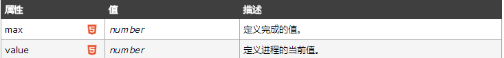
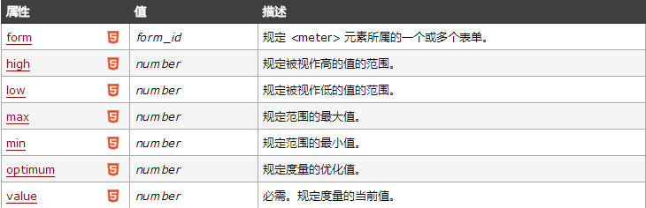
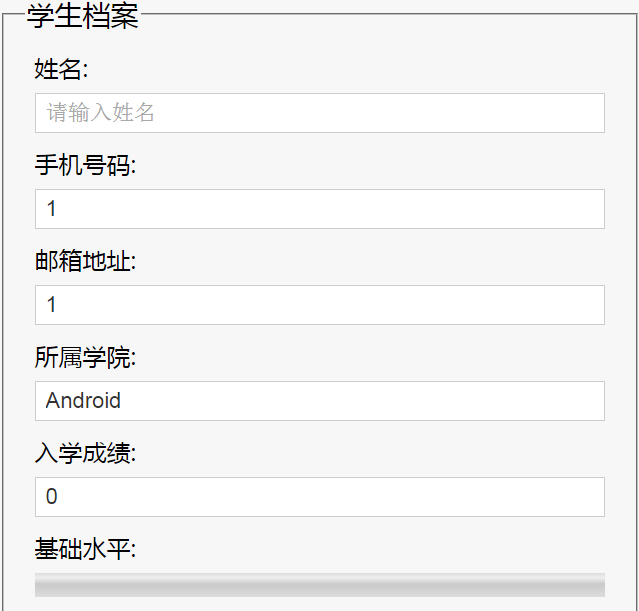
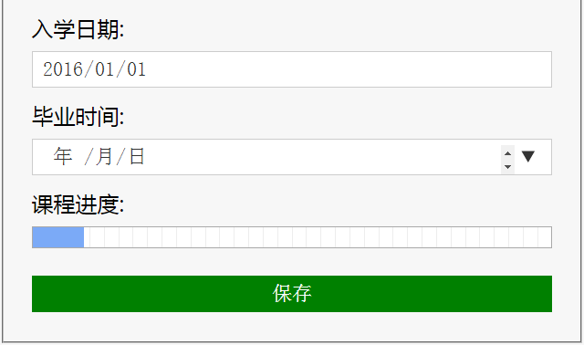
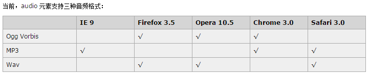
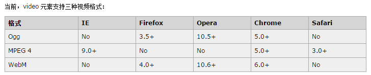

# HTML5第一天

# 1前言

## **1.1** **认识HTML5**

前面我们学习的html是什么？

  Html4.0 

 网页开发：   html 结构  4.0

​					Css ->样式  2.0 

​					Js  行为 用户交互

HTML5  是html4.0 升级版

​			 结构 Html5 、样式 css3 、行为: API  都有所增强 

HTML5并不仅仅只是做为HTML标记语言的一个最新版本，更重要的是它制定了Web应用开发的一系列标准，成为第一个将Web做为应用开发平台的HTML语言。

HTML5定义了一系列新元素，如新语义标签、智能表单、多媒体标签等，可以帮助开发者创建富互联网应用，还提供了一些Javascript API，如地理定位、重力感应、硬件访问等，可以在浏览器内实现类原生应用，甚至结合Canvas我们可开发网页版游戏。

广义概念：HTML5代表浏览器端技术的一个发展阶段。在这个阶段，浏览器呈现技术得到了一个飞跃发展和广泛支持，它包括：HTML5，CSS3，Javascript，API在内的一套技术组合  

H5范称

HTML + CSS3 + JS   

优点：http://www.intertid.com/school/2014/595568.shtml

## **1.2** **语法规范**

HTML5在语法规范上也做了比较大的调整，去除了许多冗余的内容，书写规则更加简洁、清晰。

见代码实例

```html
<!DOCTYPE html>
<html lang="en">
<head>
    <meta charset="UTF-8">
    <title>Title</title>
</head>
<body>
    <P>我是一段文本，我闭合标签用了大写</P>
    
</body>
</html>
```

**特点：**

1、更简洁

2、更宽松

​		单标签不用写关闭符号
​			双标签省略结束标签

 		html、head、body、colgroup、tbody可以完全省略		

实际开发中应规范书写，不建议太随意 ！

# 2语义标签

语义标签对于我们并不陌生，如<p>表示一个段落、<ul>表示一个无序列表<h1> ~ <h6>表示一系列标题等，在此基础上HTML5增加了大量更有意义的语义标签，更有利于搜索引擎或辅助设备理解HTML页面内容。

传统的做法我们或许通过增加类名如class="header"、class="footer"，使HTML页面具有语义性，但是不具有通用性。

HTML5则是通过新增语义标签的形式来解决这个问题，例如<header></header>、<footer></footer>等，这样就可以使其具有通用性。

此章节学习目的为了解增加语义标签的目的，以及各语义标签所表达的意义，在网页布局中能够合理使用标签。

传统网页布局：

   

```html
 <!-- 头部 -->
	<div class="header">
  		 <ul class="nav"></ul>
	</div>
      <!-- 主体部分 -->
      <div class="main">
         <!-- 文章 -->
      <div class="article"></div>
      <!-- 侧边栏 -->
      <div class="aside"></div>
      </div>
       <!-- 底部 -->
      <div class="footer"></div>
```

**H5 经典网页布局:**

```html
<!-- 头部 -->
<header>
    <ul class="nav"></ul>
</header>
<!-- 主体部分 -->
<div class="main">
   <!-- 文章 -->
   <article></article>
   <!-- 侧边栏 -->
   <aside></aside>
</div>
<!-- 底部 -->
<footer></footer>
```


<footer></footer>
## **2.1** **常用新语义标签**

```
<nav> 表示导航
<header> 表示页眉
<footer> 表示页脚
<section> 表示区块
<article> 表示文章 如文章、评论、帖子、博客
<aside> 表示侧边栏 如文章的侧栏
<figure> 表示媒介内容分组 与 ul > li 做个比较
<mark> 表示标记 (文本有背景颜色,表示标记)
<progress> 表示进度
<time> 表示日期 ( 包裹时间 )
```

本质上新语义标签与<div>、<span>没有区别，只是其具有表意性，使用时除了在HTML结构上需要注意外，其它和普通标签的使用无任何差别，可以理解成<div class="nav"> 相当于 <nav>。不要好奇，它只是一个标签！

尽量避免全局使用header、footer、aside等语义标签。

 

## **2.2** 兼容处理

(我们在测试ie 的兼容的时候，有一个叫做ietest 的软件，这个软件可以模拟ie6-ie11)

​     在不支持HTML5新标签的浏览器里，会将这些新的标签解析成行内元素(inline)对待，所以我们只需要将其转换成块元素(block)即可使用，但是在IE9版本以下，并不能正常解析这些新标签，但是却可以识别通过document.createElement('tagName')创建的自定义标签，于是我们的解决方案就是将HTML5的新标签全部通过document.createElement('tagName')来创建一遍，这样IE低版本也能正常解析HTML5新标签了，在实际开发中我们更多采用的是通过检测IE浏览器的版本来加载三方的一个JS库来解决兼容问题。

```html
<!--[if lte IE 8]>
        <script src="./js/html5shiv.min.js"></script>
<![endif]-->
```

 

# 第3表单

伴随着互联网富应用以及移动开发的兴起，传统的Web表单已经越来越不能满足开发的需求，所以HTML5在Web表单方向也做了很大的改进，如拾色器、日期/时间组件等，使表单处理更加高效。

此章节学习目的，了解HTML5表单的新增的特性，以及PC和移动设备间的差异，其兼容性较差。

 

## **3.1** **输入类型  (表单类型，表单元素，表单属性,表单事件.)**

```
email 输入email格式

tel 手机号码  

url 只能输入url格式

number 只能输入数字

search 搜索框

range 范围 滑动条

color 拾色器

time	时间

date 日期 不是绝对的

--**datetime-local**

时间日期

month 月份

week 星期
```

部分类型是针对移动设备生效的，且具有一定的兼容性，在实际应用当中可选择性的使用。

## **3.2** **表单元素（标签）**

智能表单( 输入指定文本提供备选 )  

```html
<datalist> 数据列表

  与input 配合使用

<input type=”text” list=”  car  ”>

<datalist id="  car   ">

        <option>宝马</option>

        <option>宝骏</option>

        <option>宝强</option>

        <option>宝宝</option>

        <option>奥迪</option>

        <option>奥迪奥</option>

        <option>迪奥</option>

</datalist>
```

 

<progress></progress>

<progress value="40" max="100"></progress>



<meter>   表示度量器，不建议用作进度条

   <meter  value="81"   min="0" max=**"100" low=*"60"  high="80" />



## **3.3** **表单属性**

```
placeholder 占位符

autofocus 获取焦点 (打开页面焦点自动锁定在当前目标)

multiple 文件上传多选或多个邮箱地址  

autocomplete 自动完成，用于表单元素，也可用于表单自身(on/off)

(记录上次输入的信息,e-mail默认不会记录)

form 指定表单项属于哪个form，处理复杂表单时会需要

novalidate 关闭验证，可用于<form>标签 (写在form,不会对表单进行验证)

required 必填项 (不填写无法提交表单)

pattern 正则表达式 验证表单

 手机号:<input type="tel" name="tel" required="required"       pattern="^(\+86)?1[3,5,8](\d{9})$">
```

   

```html
<form action="" autocomplete="on" id="form">
    <fieldset>
        <legend>表单属性</legend>
        <label for="">
            autofocus: <input type="text" autocomplete="on" name="autofocus" autofocus required>
        </label>
        <label for="">
            placeholder: <input type="text" pattern="\D+" placeholder="这是一个占位符" novalidate>
        </label>
        <label for="">
            multiple: <input type="file" multiple>
        </label>
        <input type="submit" value="提交">
    </fieldset>
</form>
<label for="">
    表单外的一个元素：
    <input type="text" name="outer" form="form">
</label>
```


## **3.4** **表单事件**

oninput 用户输入内容时触发，可用于移动端输入字数统计(js直接调用)

oninvalid 验证不通过时触发(js直接调用)

```html
<form action="" autocomplete="on" id="form">
    <fieldset>
        <legend>表单属性</legend>
        <label for="">
            oninput: <input type="email" id="input">
        </label>
        
        <input type="submit" value="提交">
    </fieldset>
</form>
<script>
    var input = document.getElementById("input");
    input.oninvalid = function () {
        this.setCustomValidity("请输入正确的邮箱地址")
    }
</script>
```

 

## 3.5案例练习





注册表单

# 4章 **多媒体**

在HTML5之前，在网页上播放音频/视频的通用方法是利用Flash来播放，但是大多情况下，并非所有用户的浏览器都安装了Flash插件，由此使得处理音频/视频播放变的非常复杂，并且移动设备的浏览器并不支持Flash插件。

Media palyer 

此章节学习目的，了解如何通过HTML5播放音频/视频，以及针对不同浏览器所支持的格式，做多浏览器兼容处理。

## **4.1** **音频**

HTML5通过<audio>标签来解决音频播放的问题。

使用相当简单，如下图所示

```html
<!--通过src指定音频文件路径即可-->
<audio src="./music/xxx.mp3"></audio>
```

并且可以通过附加属性可以更友好控制音频的播放，如：

autoplay 如果出现该属性，则视频在就绪后马上播放

controls 如果出现该属性，则向用户显示控件，比如播放按钮。

loop 循环播放

preload 预加载 同时设置autoplay时些属性失效

| **值** | **描述**                                                     |      |
| ------ | ------------------------------------------------------------ | ---- |
| load   | 规定是否预加载视频。可能的值：· auto - 当页面加载后载入整个视频· meta - 当页面加载后只载入元数据· none - 当页面加载后不载入视频 |      |

 

由于版权等原因，不同的浏览器可支持播放的格式是不一样的



**多浏览器支持的方案**

```html
<audio controls>
    <!--通过source标签指定多格式音频文件-->
    <source src="./music/xxx.mp3">
    <source src="./music/xxx.wav">
    <source src="./music/xxx.ogg">
    您的浏览器不支持HTML音频播放功能
</audio>
```


## **4.2** **视频**

HTML5通过<video>标签来解决音频播放的问题。

同音频播放一样，<video>使用也相当简单，如下图

```html
<!--通过src属性指定视频文件的路径-->
<video src="./video/movie.mp4" controls="controls"></video>
```

同样，通过附加属性可以更友好的控制视频的播放

autoplay 自动播放

controls 是否显示默认播放控件

loop 循环播放

preload 预加载，同时设置了autoplay，此属性将失效

width 设置播放窗口宽度

height 设置播放窗口的高度

由于版权等原因，不同的浏览器可支持播放的格式是不一样的



**多浏览器支持的方案**

```html
<video  controls="controls">
    <!--通过source标签指定多格式视频文件-->
    <source src="./video/xxx.ogg">
    <source src="./video/xxx.mp4">
    您的浏览器不支持HTML视频播放功能
</video>
```


# 5DOM扩展

## **5.1** **获取元素**

1、document.getElementsByClassName ('class') 通过类名获取元素，以类数组形式存在。

2、document.querySelector(‘#box’) 通过CSS选择器获取元素，符合匹配条件的第1个元素。

3、document.querySelectorAll('selector') 通过CSS选择器获取元素，以类数组形式存在。

## **5.2** **类名操作**

1、Node.classList.add('class') 添加class

2、Node.classList.remove('class') 移除class

3、Node.classList.toggle('class') 切换class，有则移除，无则添加

4、Node.classList.contains('class') 检测是否存在class

Node指一个有效的DOM节点，是一个通称。

## **5.3** **自定义属性**

在HTML5中我们可以自定义属性，其格式如下data-*=""，例如

data-info="我是自定义属性"，通过Node.dataset['info'] 我们便可以获取到自定义的属性值。

Node.dataset是以类对象形式存在的

当我们如下格式设置时，则需要以驼峰格式才能正确获取

data-my-name="itcast"，获取Node.dataset['myName']


 