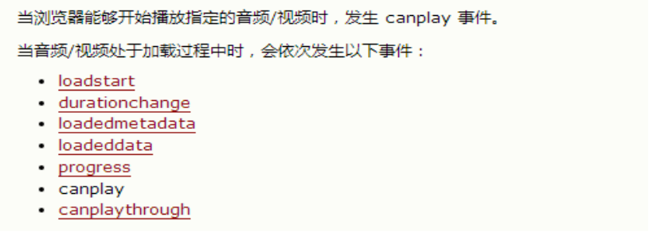
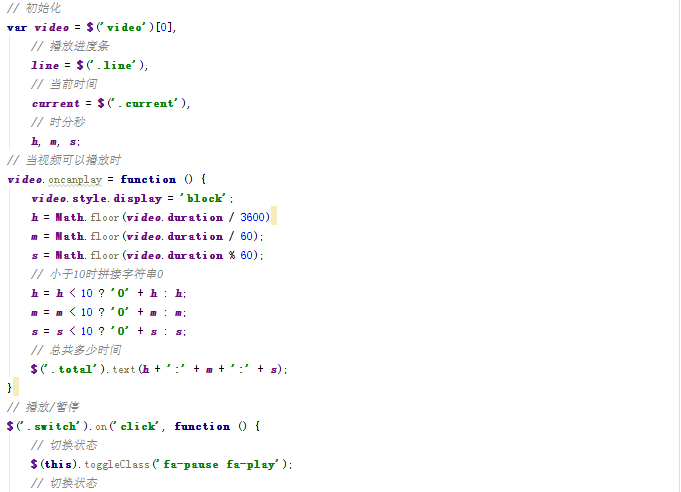
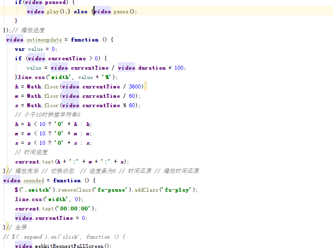

## **新增API**

### **多媒体**

方法：load() 加载、play() 播放、pause() 暂停

属性：currentTime 视频播放的当前进度(播放的当前时间)

​      duration:视频的总时间

​      paused:视频播放的状态.

事件：

​     oncanplay: 事件在用户可以开始播放视频/音频（audio/video）时触发。

​     ontimeupdate:通过该事件来报告当前的播放进度

(播放时一直触发)

​			(当拖动进度条时触发该事件)

​    onended:播放完时触发

 



全屏：video.webkitRequestFullScreen();



 

### **拖拽**

在HTML5的规范中，我们可以通过为元素增加draggable="true"来设置此元素是否可以进行拖拽操作，其中图片、链接默认是开启的。

#### **拖拽元素**

页面中设置了draggable="true"属性的元素

#### **目标元素**

页面中任何一个元素都可以成为目标元素

#### **事件监听**

**拖拽元素**

ondrag 		应用于拖拽元素，整个拖拽过程都会调用

ondragstart	应用于拖拽元素，当拖拽开始时调用

ondragleave	应用于拖拽元素，当鼠标离开拖拽元素时调用

ondragend	应用于拖拽元素，当拖拽结束时调用

**目标元素**

ondragenter	应用于目标元素，当拖拽元素进入时调用

ondragover	应用于目标元素，当停留在目标元素上时调用

ondrop		应用于目标元素，当在目标元素上松开鼠标时调用

ondragleave	应用于目标元素，当鼠标离开目标元素时调用

 

**preventDefault方法就是可以阻止它的默认行为的发生而发生其他的事情。**

### **历史**

提供window.history，对象我们可以管理历史记录，可用于单页面应用，Single Page Application，可以无刷新改变网页内容。

旧版本浏览器..

history.back() 回退

history.forward() 前进

### **Web存储**

随着互联网的快速发展，基于网页的应用越来越普遍，同时也变的越来越复杂，为了满足各种各样的需求，会经常性在本地存储大量的数据，传统方式我们以document.cookie来进行存储的，但是由于其存储大小只有4k左右，并且解析也相当的复杂，给开发带来诸多不便，HTML5规范则提出解决方案。

Storage 存储  

window.sessionStorage

window.localStorage

(向本地保存数据,有可能在浏览器内存里面，有可能在硬盘上面.)

#### **特性**

1、设置、读取方便

2、容量较大，sessionStorage约5M、localStorage约20M

3、只能存储字符串，可以将对象JSON.stringify() 编码后存储

#### **window.sessionStorage**

1、生命周期为关闭浏览器窗口

2、在同一个窗口下数据可以共享

#### **window.localStorage**

1、永久生效，除非手动删除

2、可以多窗口共享

#### **方法详解**

```
setItem(key, value) 设置存储内容

getItem(key) 读取存储内容

removeItem(key) 删除键值为key的存储内容

clear() 清空所有存储内容

key(n) 以索引值来获取存储内容
```

案例：记住用户名

#### **其它**

WebSQL、IndexDB

已经被w3c 放弃了..

生命周期差异，存储空间差异

WebSQL、IndexDB

### **全屏**

 HTML5规范允许用户自定义网页上任一元素全屏显示。

 requestFullscreen() 开启全屏显示

 cancleFullscreen() 关闭全屏显示

不同浏览器需要添加前缀如：

 webkitRequestFullScreen、mozRequestFullScreen

 webkitCancleFullScreen、mozCancleFullScreen

 通过document.fullScreen检测当前是否处于全屏

 不同浏览器需要添加前缀

​     document.webkitIsFullScreen、document.mozFullScreen

全屏伪类

:full-screen .box {}、:-webkit-full-screen {}、:moz-full-screen {}

```js
var docElm = document.documentElement;
    if (docElm.requestFullscreen) {
       docElm.requestFullscreen();
    }
    else if (docElm.mozRequestFullScreen) {
       docElm.mozRequestFullScreen();
    }
    else if (docElm.webkitRequestFullScreen) {
       docElm.webkitRequestFullScreen();
    }
```

 

### **网络状态**

我们可以通过window.onLine来检测，用户当前的网络状况，返回一个布尔值

(切换网络时触发)

   window.online用户网络连接时被调用

   window.offline用户网络断开时被调用

**window**.addEventListener(**"online"**,**function**(){
         alert(**"已经建立了网络连接"**)
    })
   **window**.addEventListener(**"offline"**,**function**(){
         alert(**"已经失去了网络连接"**)
   })

