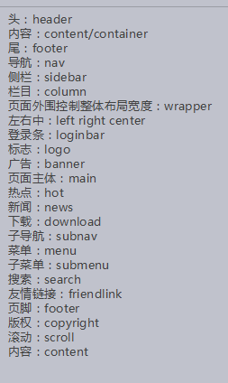
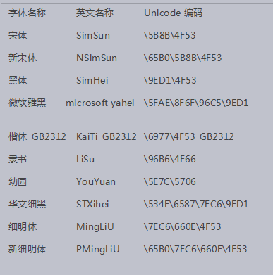

# css基础

## css概念

CSS 指层叠样式表 (Cascading Style Sheets)(级联样式表)

Css是用来美化html标签的，相当于页面化妆。

◆样式表书写位置

```html
<head>
    <meta charset="UTF-8">
    <title>Document</title>
    <style type="text/css">
        样式表内容
    </style>
    
</head>
```

## 选择器

### 写法

选择器是一个选择谁（标签）的过程。

```
选择器{属性:值;属性:值;}
```

| 属性                                  | 解释                   |
| ------------------------------------- | ---------------------- |
| **width:20px;**                       | **宽**                 |
| **height:20px;**                      | **高**                 |
| **background-color:red;**             | **背景颜色**           |
| **font-size:24px;**                   | **文字大小**           |
| **text-align:left \| center\| right** | **内容的水平对齐方式** |
| **text-indent:2em;**                  | **首行缩进**           |
| **color:red;**                        | **文字颜色**           |

## 选择器

### 基础选择器

#### 标签选择器

```
标签{属性：值;}
```

特点：标签选择器定义之后，会将页面所有的元素都执行这个标签样式。

#### 类选择器（重点）

写法

```
.自定义类名{属性:值;  属性:值；}
```

特点： 谁调用，谁生效。

​        一个标签可以调用多个类选择器。

​       多个标签可以调用同一个类选择器。

  ★类选择器命名规则

   ◎不能用纯数字或者数字开头来定义类名

   ◎不能使用特殊符号或者特殊符号开头（_）来定义类名

   ◎不建议使用汉字来定义类名

   ◎不推荐使用属性(css关键字)或者属性的值来定义类名

关键字:凡是被css语言所定义过的词语就叫做关键字



#### ID选择器

写法

```
#自定义名称{属性:值;}
```

特点： 一个ID选择器在一个页面只能调用一次。如果使用2次或者2次以上，不符合w3c规范，JS调用会出问题。

  一个标签只能调用一个ID选择器。

一个标签可以同时调用类选择器和ID选择器。

#### 通配符选择器

```
*{属性:值;}
```

特点：给所有的标签都使用相同的样式。

★不推荐使用，增加浏览器和服务器负担。

◆颜色的显示方式

  ◎直接写颜色的名称

  ◎十六进制显示颜色      0-9  a-f  RGB

\#000000; 前2为代表红色，中间2位代表绿色，后边2位代表蓝色。

  ◎rgb

```html
color:rgb(120,120,120)
```

  ◎rgba

a代表alpha 不透明度   值 0-1

```
color:rgba(120,120,120,0.5)
```

### 复合选择器

概念：两个或者两个以上的基础选择器通过不同的方式连接在一起。

#### 交集选择器

```
标签+类（ID）选择器{属性：值；}
```

特点：即要满足使用了某个标签，还要满足使用了类（id）选择器。

```html
<style type="text/css">
    .box{
        font-size:40px;
    }
    div.box{
        color:yellow;
    }
</style>
</head>
<body>
    <div class="box">
        div_交集选择器
    </div>
    <p class="box">
        p_交集选择器
    </p>
    <div>
        来看看我行不行
    </div>
</body>
```

#### 后代选择器（重点）

```
选择器+空格+选择器{属性：值;}
```

后代选择器首选要满足包含（嵌套）关系。

父集元素在前边，子集元素在后边。

特点：无限制隔代。

​      只要能代表标签，标签、类选择器、ID选择器自由组合。

```html
<style type="text/css">
    .box{
        font-size:40px;
    }
    .miss{
        color:yellow;
    }
    div span{
        color:red;
    }
    div p span{
        color:green;
    }
    div .miss{
        background-color:pink;
    }
    .box .miss{
        font-size:100px;
    }
</style>
</head>
<body>
    <div class="box">
        <p>
            <span class="miss">
                哈哈
            </span>
        </p>
    </div>
    <div class="box">
        <span>
            哈哈哈
        </span>
    </div>
    
</body>
```

#### 子代选择器

```
选择器>选择器{属性:值;}
```

选中直接下一代元素。

```html
<style type="text/css">
    div>span{
        color:red;
    }
    p>span{
        font-size:40px;
    }
</style>
</head>
<body>
    <p>
        <span>
            子代选择器
        </span>
    </p>
    <span>
        呼呼哈嘿
    </span>
</body>
```

#### 并集选择器

```
选择器+，+选择器+，选择器{属性:值;}
```

```css
.box,#miss,span,h1{
	font-size:100px;
	color:#fff;
	background-color:green;
}
```

## 文本元素

### 属性

font-size:16px;  文字大小

font-weight: 700 ; 值从100-900，文字粗细，不推荐使用(font-weight:bold;)

font-family:微软雅黑(Lobster-Regular);  文本的字体

font-style: normal / italic;      normal 默认值  italic  斜体

line-height: 行高

```css
div{
	font-size:16px;
    font-weight:700;
    font-family:微软雅黑;
    font-style:italic;
    line-height:40px;
}
```

### 文本属性连写

```css
font: font-style font-weight  font-size/line-height  font-family;
```

◆注意：font:后边写属性的值。一定按照书写顺序。

​      文本属性连写文字大小和字体为必写项。

font:italic 700 16px/40px  微软雅黑;

### 文字的表达方式

#### 直接写中文名称。

```css
div{
    font-family:微软雅黑;
    font-size:60px;
}
```

#### 写字体的英文名称。

```css
div{
    font-family:microsoft yahei;
    font-size:60px;
}
```

#### unicode 编码



## 样式表书写位置

### 内嵌式写法

```css
<head>

    <style type=”text/css”>

    	样式表写法

    </style>

</head>
```


### 外链式写法

写在head里，<link rel="stylesheet" href="1.css">

```html
<!-- 外链式写法 -->
<link rel="stylesheet" href="1.css">
```

### 行内样式表

```html
<!-- 行内样式表 -->
<h1 style="font-size:30px;color:red;">
    h1标题
</h1>
```

### 三种写法特点:

★内嵌式写法，样式只作用于当前文件，没有真正实现结构表现分离。

★外链式写法，作用范围是当前站点，谁调用谁生效，范围广，真正实现结构表现分离。推荐使用

★行内样式表，作用范围仅限于当前标签，范围小，结构表现混在一起。  （不推荐使用）

## 标签分类(显示方式)

### 块元素

典型代表,div,h1-h6,p,ul,li

特点: ★独占一行

​      ★可以设置宽高

​      ★ 嵌套（包含）下，子块元素宽度（没有定义情况下）和父块元素宽度默认一致。

### 行内元素

典型代表 span  ,a,  ,strong , em,  del,  ins

特点：★在一行上显示

​      ★不能直接设置宽高

​      ★元素的宽和高就是内容撑开的宽高。

### 行内块元素(内联元素)

典型代表  input  img

特点：★在一行上显示

​      ★可以设置宽高      

### 块元素、行内元素 转换

#### 块元素转行内元素

display:inline;

```css
/*块元素转换为行内元素*/
div,p{
	display: inline;
}
```

#### 行内元素转块元素

display:block;

```css
span{
	display: block;
}
```

#### 块和行内元素转行内块元素

display:inline-block;

```css
/*块和行内元素转行内块元素*/
div,a,span,strong{
	display: inline-block;
}
```

## css三大特性

### 层叠性

当多个样式作用于同一个（同一类）标签时，样式发生了冲突，总是执行后边的代码。和标签调用选择器的顺序没有关系。

### 继承性

   继承性发生的前提是包含（嵌套关系）

   ★文字颜色可以继承

   ★文字大小可以继承

   ★字体可以继续

   ★字体粗细可以继承

   ★文字风格可以继承

   ★行高可以继承

   总结：文字的所有属性都可以继承。

#### 特殊情况：

h系列不能继承文字大小。

a标签不能继承文字颜色。

### 优先级   

默认样式<标签选择器<类选择器<id选择器<行内样式<!important  

​         0         1          10     100      1000      1000以上

```html
</style>
		#con{
			color: pink;
			font-size: 100px;
		}
		.box{
			color: green;
			font-size: 60px;
		}
		div{
			color:red !important;
			font-size:80px !important;
		}
	</style>
</head>
<body>
	<div class="box" id="con" style="font-size: 12px;color: yellow"></div>
```

**优先级特点**

**★继承的权重为0**

**★权重会叠加**

## 链接伪类

a:link{属性:值;}  a{属性:值}效果是一样的。

a:link{属性:值;}       链接默认状态  

a:visited{属性:值;}     链接访问之后的状态 

a:hover{属性:值;}      鼠标放到链接上显示的状态

a:active{属性:值;}      链接激活的状态

a:focus{属性:值；}     获取焦点

 

### 文本修饰

text-decoration: none  |   underline   |     line-through

## 背景属性

background-color     背景颜色

background-image    背景图片

background-repeat    repeat(默认)  |  no-repeat |   repeat-x   |  repeat-y     背景平铺

background-position  left  |  right  |  center  |  top  | bottom  背景定位

```css
background-position: right;
```

★方位值只写一个的时候，另外一个值默认居中。

```css
background-position: right bottom;
```

★写2个方位值的时候，顺序没有要求。

```css
background-position: 20px 30px;
```

★写2个具体值的时候，第一个值代表水平方向，第二个值代表垂直方向。

background-attachment   背景是否滚动   scroll  |  fixed

背景属性连写

```css
background: red url("1.png") no-repeat 30px 40px scroll;
```

★：连写的时候没有顺序要求，url为必写项。