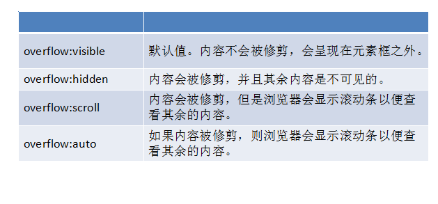

# Css基础

## 文档流（标准流）

元素自上而下，自左而右，块元素独占一行，行内元素在一行上显示，碰到父集元素的边框换行。

## 浮动布局

float:  left   |   right

特点：

★元素浮动之后不占据原来的位置（脱标）

★浮动的盒子在一行上显示

★行内元素浮动之后转换为行内块元素。（不推荐使用，转行内元素最好使用display: inline-block;）

### 浮动的作用

◆文本绕图

◆制作导航

◆网页布局

## 清除浮动

当父盒子没有定义高度，嵌套的盒子浮动之后，下边的元素发生位置错误。

◆清除浮动不是不用浮动，清除浮动产生的不利影响。

◆清除浮动的方法

clear: left  |  right  | both

工作里用的最多的是clear:both;

★额外标签法

 在最后一个浮动元素后添加标签,。  

```html
<div class="main">
		<div class="content"></div>
		<div class="sidebar"></div>
		<!-- 额外标签法 -->
		<div style="clear: both;"></div>
</div>
```

★给父集元素使用overflow:hidden; 

  如果有内容出了盒子，不能使用这个方法。

```css
.main{
		background: #eee;
		margin:10px 0;
		overflow: hidden;
}
```

★伪元素清除浮动  推荐使用

```html
<style>
		.clearfix:after{
			content: "";
			display: block;
			height: 0;
			line-height: 0;
			visibility: hidden;
			clear: both;
		}
		/*兼容ie浏览器*/
		.clearfix{
			zoom:1;
		}
	</style>
</head>
<body>
	<div class="header"></div>
	<!-- 浮动元素的父盒子调用伪元素清除浮动 -->
	<div class="main clearfix"></div>
	<div class="left"></div>
	<div class="content">
		<div class="content-top"></div>
		<div class="content-bot"></div>
	</div>
	<div class="right"></div>
</body>
```

## CSS初始化

为了考虑到浏览器兼容问题,不同的浏览器对有些标签的默认值是不同的,如果没有CSS初始化会出现浏览器之间的页面差异

腾讯：

body,ol,ul,h1,h2,h3,h4,h5,h6,p,th,td,dl,dd,form,fieldset,legend,input,textarea,select{margin:0;padding:0} 

body{font:12px"宋体","Arial Narrow",HELVETICA;background:#fff;-webkit-text-size-adjust:100%;} 

a{color:#2d374b;text-decoration:none} 

a:hover{color:#cd0200;text-decoration:underline} 

em{font-style:normal} 

li{list-style:none} 

img{border:0;vertical-align:middle} 

table{border-collapse:collapse;border-spacing:0} 

p{word-wrap:break-word} 

 

 

新浪：

body,ul,ol,li,p,h1,h2,h3,h4,h5,h6,form,fieldset,table,td,img,div{margin:0;padding:0;border:0;} 

body{background:#fff;color:#333;font-size:12px; margin-top:5px;font-family:"SimSun","宋体","Arial Narrow";}

ul,ol{list-style-type:none;} 

select,input,img,select{vertical-align:middle;} 

a{text-decoration:none;} 

a:link{color:#009;} 

a:visited{color:#800080;} 

a:hover,a:active,a:focus{color:#c00;text-decoration:underline;} 

淘宝：

body, h1, h2, h3, h4, h5, h6, hr, p, blockquote, dl, dt, dd, ul, ol, li, pre, form, fieldset, legend, button, input, textarea, th, td { margin:0; padding:0; } 

body, button, input, select, textarea { font:12px/1.5tahoma, arial, \5b8b\4f53; } 

h1, h2, h3, h4, h5, h6{ font-size:100%; } 

address, cite, dfn, em, var { font-style:normal; } 

code, kbd, pre, samp { font-family:couriernew, courier, monospace; } 

small{ font-size:12px; } 

ul, ol { list-style:none; } 

a { text-decoration:none; } 

a:hover { text-decoration:underline; } 

sup { vertical-align:text-top; } 

sub{ vertical-align:text-bottom; } 

legend { color:#000; } 

fieldset, img { border:0; }

button, input, select, textarea { font-size:100%; } 

table { border-collapse:collapse; border-spacing:0; } 

## Overflow



## 定位

定位方向: left  | right  | top  | bottom

### ◆ 静态定位。默认值，就是文档流。

```css
/*静态定位*/
position:static;
```

### ◆绝对定位

```css
position:absolute;
```

特点：

★元素使用绝对定位之后不占据原来的位置（脱标）

★元素使用绝对定位，位置是从浏览器出发。

★嵌套的盒子，父盒子没有使用定位，子盒子绝对定位，子盒子位置是从浏览器出发。

★嵌套的盒子，父盒子使用定位，子盒子绝对定位，子盒子位置是从父元素位置出发。

★给行内元素使用绝对定位之后，转换为行内块。（不推荐使用，推荐使用display:inline-block;）

### ◆相对定位

```css
position: relative;
```

特点：

★使用相对定位，位置从自身出发。

★还占据原来的位置。

★**子绝父相（父元素相对定位，子元素绝对定位）**

★行内元素使用相对定位不能转行内块

### ◆固定定位

```css
position:fixed;
```

特点：

★固定定位之后，不占据原来的位置（脱标）

★元素使用固定定位之后，位置从浏览器出发。

★元素使用固定定位之后，会转化为行内块（不推荐，推荐使用display:inline-block;）