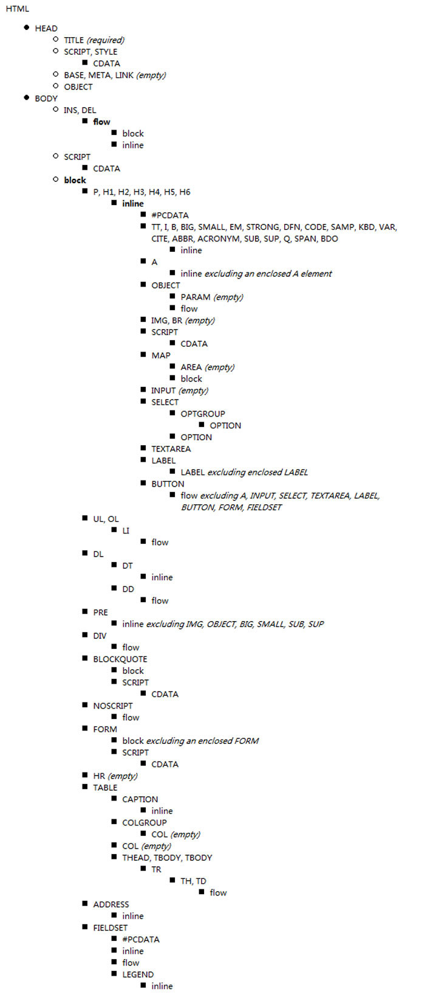
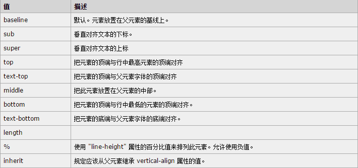

# css基础  

## 定位的盒子居中显示

★:margin:0 auto;  只能让标准流的盒子居中对齐。

★定位的盒子居中：先左右走父元素盒子的一半50%，在向左走子盒子的一半(margin-left:负值。)

```css
.nav{
	width:960px;
    height:60px;
    background:#666;
    position:absolute;
    bottom:0;
    left:50%;
    margin-left:-480px;
}
```

## 标签包含规范

◆div可以包含所有的标签。

◆p标签不能包含div h1等标签。

◆h1可以包含p，div等标签。

◆行内元素尽量包含行内元素，行内元素不要包含块元素。



## 规避脱标流

◆尽量使用标准流。

◆标准流解决不了的使用浮动。

◆浮动解决不了的使用定位。

```css
/*设置盒子做外边距为auto，将盒子冲到右边*/
margin-left:auto;
```

## 图片和文字垂直居中对齐

vertical-align对inline-block最敏感。默认属性是:vertical-align:baseline;

```css
img{
	/*图片和文字垂直居中对齐*/
	vertical-align:middle;
}
```



## Css可见性

overflow:hidden;   溢出隐藏    

visibility:hidden;   隐藏元素    隐藏之后还占据原来的位置。

display:none;      隐藏元素    隐藏之后不占据原来的位置。

display:block;     元素可见

display:none  和display:block  常配合js使用。

## css之内容移除（网页优化）

◆使用text-indent:-5000em;

```css
a{
    display:inline-block;
    text-indent:-5000em;
}
```

◆将元素高度设置为0,使用内边距将盒子撑开，给盒子使用overflow:hidden;将文字隐藏。

```css
.box{
    width:300px;
    height:0;
    padding-top:100px;
    overflow:hidden;
    background:red;
}
```

## Css精灵图

```css
.box{
			width: 28px;
			height: 20px;
			background: url("精灵图导航练习/sprite.png") no-repeat -57px 0px;
			position: absolute;
			top: -7px;
			left: 50%;
			margin-left: -14px;
		}
```


## 属性选择器

```
input[type=text][css]{
	width:300px;
	height:300px;
	background:red;
}
```

## emmet快捷键：

emmet是我们在sublime中的一个插件在这个插件中集成很多的快捷键。

###  html:

#### 生成结构的快捷键：

！+ tab,可以生成html5的结构代码。

#### 生成id名和类名

标签名.类名#id名+tab

没有标签名.类名+tab ==>div

#### 生成同级元素：

标签名+标签名+标签名 “+”tab

#### 生成子类标签

标签名>子标签名>子标签名>子标签名+tab

标签名>子标签名>子标签名>子标签名^^子标签名+tab

#### 带固定数量的标签:

ul>li*5+tab

#### 带有序号名称     

ul>li.abc$*3 + tab

#### 生成带有内容的标签：

ul>li>a{item}*5

### css

width:30px==>w30+tab

Height:30px==>h30+tab

Margin:30px==>mg30+tab

Padding:30px==> pd30+tab

Line-height:12px==>lh12px+tab

Background==>bg+tab  