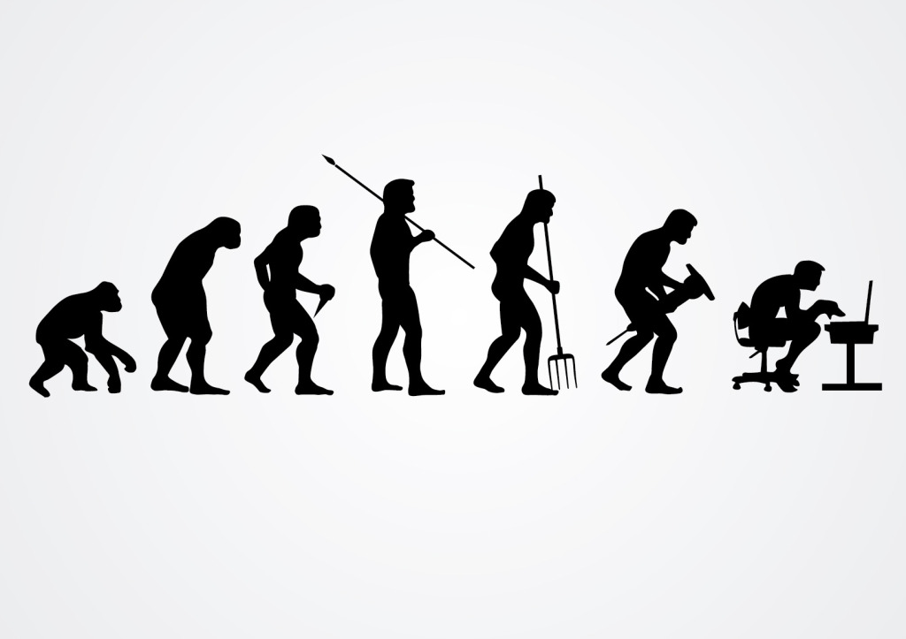
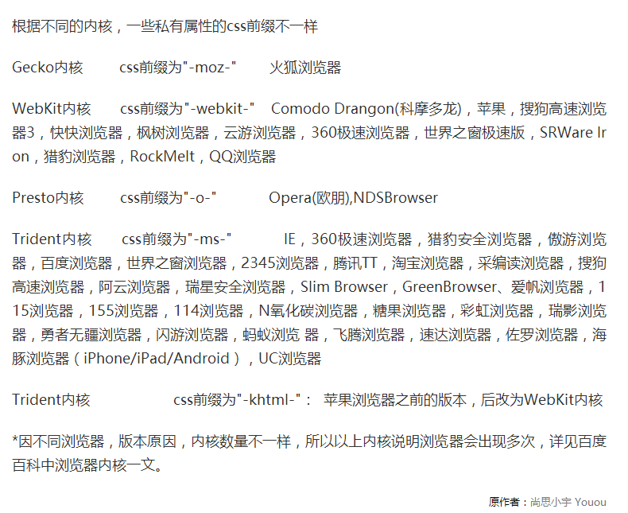

# 1 CSS3简介



如同人类的的进化一样，CSS3是CSS2的“进化”版本，在CSS2基础上，增强或新增了许多特性， 弥补了CSS2的众多不足之处，使得Web开发变得更为高效和便捷。

## **1.1** **CSS3的现状**

1、浏览器支持程度差，需要添加私有前缀

2、移动端支持优于PC端

3、不断改进中

4、应用相对广泛

-webkit-border-radius  **radius 半径**



## **1.2** **如何对待**

1、坚持渐进增强原则

2、考虑用户群体

3、遵照产品的方案

4、听Boss的

# 2 准备工作

## **2.1** **统一环境**

由于CSS3兼容性问题的普遍存在，为了避免因兼容性带来的干扰，我们约定统一的环境，以保证学习的效率，在最后会单独说明兼容性的问题。

1、Chrome浏览器 version 46+    2、Firefox浏览器 firefox 42+

## **1.1** **如何使用手册**

学会使用工具，可以让我们事半功倍。

[]		表示全部可选项  padding

||		表示或者    

|		表示多选一

？	表示0个或者1个

*表示0个或者多个

{}		表示范围

学会查看手册，培养自主学习能力。

# 3 基础知识

## **1.2** **选择器** 

CSS3新增了许多灵活查找元素的方法，极大的提高了查找元素的效率和精准度。CSS3选择器与jQuery中所提供的绝大部分选择器兼容。

### **1.2.1** **属性选择器**

其特点是通过属性来选择元素，具体有以下5种形式：

```
1、E[attr] 表示存在attr属性即可；

   div[class]

2、E[attr=val] 表示属性值完全等于val；

   div[class=mydemo]

3、E[attr*=val] 表示的属性值里包含val字符并且在“任意”位置；

   div[class\*=mydemo]

4、E[attr^=val] 表示的属性值里包含val字符并且在“开始”位置；

   div[class^=mydemo]

5、E[attr$=val] 表示的属性值里包含val字符并且在“结束”位置；

   div[class$=demos]
```

案例  配合jQuery 的过滤选择器

 

 

### **1.2.2** **伪类选择器**

除了以前学过的:link、:active、:visited、:hover，CSS3又新增了其它的伪类选择器。

1、以某元素相对于其父元素或兄弟元素的位置来获取无素的结构伪类。

重点理解通过E来确定元素的父元素。

E:first-child第一个子元素

E:last-child最后一个子元素

E:nth-child(n) 第n个子元素，计算方法是E元素的全部兄弟元素；

```css
  div>ul>li:nth-child(3){
      color: deeppink;
  }  
```

**第三个元素**

E:nth-last-child(n) 同E:nth-child(n) 相似，只是倒着计算；

```css
div>ul>li:last-child(2){         
    color: deeppink;
}
```

  n遵循线性变化，其取值0、1、2、3、4、... 但是当n<=0时，选取无效。

  

```css
选中所有的奇数的li
   li:nth-child(2n-1){
       color: red;
   }
  选中所有的7 的倍数的li 

li:nth-child(7n){
      color: red;
    }
   选中前面五个
   li:nth-child(-1n+5){
       color: red;
   }
   选中后面五个
   li:nth-last-child(-1n+5){

	 color: red;
   }
   所有的偶数
   li:nth-child(even){
      color:red
   }
   所有的奇数
   li:nth-child(odd){
      color:blue;
   }
```

n可是多种形式：nth-child(2n)、nth-child(2n+1)、nth-child(-1n+5)等；

E:empty 选中没有任何子节点的E元素；（使用不是非常广泛）

没有任何的子元素，包括空格.

案例：日历图.

2、目标伪类

E:target 结合锚点进行使用，处于当前锚点的元素会被选中；

```
    <li><a href="#title1">CSS (层叠样式表)</a></li>

	  <h2 id="title1">CSS (层叠样式表)</h2>

	   h2:target{

		    color:red;

	  }
```

​    图片切换

### **1.2.3** **伪元素选择器**

重点：E::before、E::after

是一个行内元素，需要转换成块元素

E:after、E:before 在旧版本里是伪类，在新版本里是伪元素，新版本下E:after、E:before会被自动识别为E::after、E::before，按伪元素来对待，这样做的目的是用来做兼容处理。

E:after、E:before后面的练习中会反复用到，目前只需要有个大致了解

E::first-letter文本的第一个字母或字（如中文、日文、韩文等）；

案例：首字下沉

E::first-line 文本第一行；  文本第一行高亮..

E::selection 可改变选中文本的样式；

":" 与 "::" 区别在于区分伪类和伪元素

  关于before和after
      CSS2中 E:before或者E:after，是属于伪类的，并且没有伪元素的概念
      CSS3中 提出伪元素的概念 E::before和E::after，并且归属到了伪元素当中，伪类里就不再存在E:before或者   E:after伪类;

## **1.3** **颜色**

一种新的颜色的表示方式

 rgba(255,0,0,0.1)

 **RGBA是代表Red（红色） Green（绿色） Blue（蓝色）和 Alpha的**[**色彩空间**](http://baike.baidu.com/view/974298.htm)**。虽然它有的时候被描述为一个颜色空间**

新增了RGBA、HSLA模式，其中的A 表示透明度通道，即可以设置颜色值的透明度，相较opacity，它们不具有继承性，即不会影响子元素的透明度。

Red、Green、Blue、Alpha即RGBA

Hue、Saturation、Lightness、Alpha即HSLA

R、G、B 取值范围0~255

H 色调 取值范围0~360，0/360表示红色、120表示绿色、240表示蓝色

S 饱和度 取值范围0%~100%

L 亮度 取值范围0%~100%

A 透明度 取值范围0~1

关于透明度：

```css
background-color:hsla(0,23%,56%,1)
```

1、opacity只能针对整个盒子设置透明度，子盒子及内容会继承父盒子的透明度；

2 、transparent 不可调节透明度，始终完全透明

RGBA、HSLA可应用于所有使用颜色的地方。

案例：
       1:  opacity 设置透明度，只能针对整个盒子设置透明度.
       2: 子盒子会继承父盒子的透明度.
      

```
 .out{
        width: 200px;
        height: 200px;
        background: green;
        border: 1px solid darkgreen;
        margin: 40px auto;
        opacity: 0.3;
  }

  子盒子也出现透明
 .out .inner{
    width: 100px;
    height: 100px;
    background-color: yellow;
  }
```

   2:background-color: transparent; 完全透明，不可调节透明度.

   3:使用rgba 来控制颜色，相对opacity ，不具有继承性.

 

## **1.4** **文本 (shadow阴影)**

text-shadow，可分别设置偏移量、模糊度、颜色（可设透明度）。

1、水平偏移量 正值向右 负值向左；

2、垂直偏移量 正值向下 负值向上；

3、模糊度是不能为负值；

代码演示：

```css
/* 3px 水平偏移量. 正值向右  负值向左*/
    /* 5px 水垂直偏移量. 正值向下 负值向上*/
    /* 5px 模糊度   模糊度不能为负值 值越大越模糊*/
    /* #ccc 设置对象阴影的颜色.
     可以有多个影子.*/
  ul>li{
     margin: 20px;
     font-size 24px;

   }

   ul>li:nth-child(1){
        text-shadow: 5px 5px 2px #ccc;
   }
   ul>li:nth-child(2){
         text-shadow: -5px  -5px 2px #ccc;
    }
   ul>li:nth-child(3){
     text-shadow: 5px 5px 2px #ccc, -5px  -5px 2px #ccc;
    }
```

**案例1：浮雕文字.**

 

```css
 /*设置背景色.*/
      body {
         background-color: gray;
         font: bold 6em "microsoft yahei";
      }

		div {
   			 margin: 30px;
    		color: #808080;
    		text-align: center;
		}

		/*设置水平向左1px 向上1 px   向右1px 向下1px */
		.to{
		        text-shadow: -1px -1px 1px #000,1px 1px 1px #fff;
		}
		.ao{
   				 text-shadow: -1px -1px 1px #000,1px 1px 1px #fff;
		}
```

 

## **1.5** **盒模型**

CSS3中可以通过box-sizing 来指定盒模型，即可指定为content-box、border-box，这样我们计算盒子大小的方式就发生了改变。

box-sizing 有两个值:content-box  border-box

可以分成两种情况：

​     content-box:对象的实际宽度等于设置的width值和border、padding之和

​     border-box： 对象的实际宽度就等于设置的width值，即使定义有border和padding也不会改变对象的实际宽度，即 ( Element width = width ) 

​     我们把这种方式叫做盒模型

 兼容性比较好