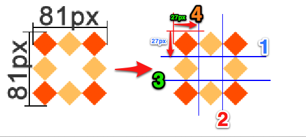
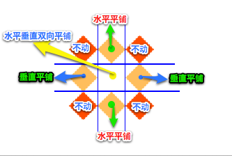

# Css3

## **1.1** **边框**

其中边框圆角、边框阴影属性，应用十分广泛，兼容性也相对较好，具有符合渐进增强原则的特征，我们需要重点掌握。

### **1.1.1** **边框圆角**

 border-radius    每个角可以设置两个值 ，x 值，y值

 1:  边框圆角处理

 2:  正方形

```css
.border-radius{
            width: 200px;
            height: 200px;
            margin: 100px auto;
            background-color: green;
            /*border-radius: 100px 100px 100px 100px/100px 100px 100px 100px;*/
            /*border-radius: 50px 100px 50px ;*/
            /*四个角都是100px*/
            /*border-radius: 100px;*/
            /*表示1，3是100px 2，4是50px*/
            /*border-radius: 100px 50px;*/
            /*表示1是100px 2，4是50px 3是80px*/
            border-radius: 100px;
 }
```

​    3：椭圆

圆角处理时，脑中要形成圆、圆心、横轴、纵轴的概念，正圆是椭圆的一种特殊情况。如下图


可分别设置长、短半径，以“/”进行分隔，遵循“1，2，3，4”规则，“/”前面的1~4个用来设置横轴半径（分别对应横轴1、2、3、4位置 ），“/”后面1~4个参数用来设置纵轴半径（分别对应纵轴1、2、3、4位置 ）

```css
.border-radius{
            width: 100px;
            height: 200px;
            margin: 100px auto;
            background-color: green;
            /*border-radius: 50px 50px 50px 50px/100px 100px 100px 100px;*/
            /*border-radius: 50px ;*/
            /*border-radius: 50px 50px 50px 50px/50px 50px 50px 50px;*/
            /*border-radius: 50px/100px;*/
            
}
```


### **1.1.2** **边框阴影**

box-shadow  与 text/shadow 用法差不多

1、水平偏移量 正值向右 负值向左；

2、垂直偏移量 正值向下 负值向上；

*box-shadow: 5px 5px 27px red, -5px -5px 27px green;*

 

3、模糊度是不能为负值；

4、inset可以设置内阴影；

```css
.item:last-child{
    box-shadow:inset 5px 5px 27px red,inset -5px -5px 27px green;
}
```

设置边框阴影不会改变盒子的大小，即不会影响其兄弟元素的布局。

可以设置多重边框阴影，实现更好的效果，增强立体感。

### **1.1.3** **边框图片**

  

```css
border-image: url("images/border.png") 27/20px round

border-image 设置边框的背景图片.

border-image-source:url(“”) 设置边框图片的地址.

//裁剪图片，如何去裁切图片，浏览器会自动去裁剪图片.

border-image-slice:27,27,27,27

//指定边框的宽度.

border-image-width:20px;

//边框平铺的样式  stretch 拉升  

round  会自动调整缩放比例

repeat(重复)

border-image-repeat: stretch;
```

 

设置的图片将会被“切割”成九宫格形式，然后进行设置。如下图



“切割”完成后生成虚拟的9块图形，然后按对应位置设置背景，

其中四个角位置、形状保持不变，中心位置水平垂直两个方向平铺。如下图



**1、round和repeat之间的区别**

round 会自动调整尺寸，完整显示边框图片。


repeat 单纯平铺多余部分，会被“裁切”而不能完整显示。


### **1.1.4案例  用css 实现**


## **1.2** **渐变**

渐变是CSS3当中比较丰富多彩的一个特性，通过渐变我们可以实现许多炫丽的效果，有效的减少图片的使用数量，并且具有很强的适应性和可扩展性。

可分为线性渐变、径向渐变

### **1.2.1** **线性渐变 （gradient 变化）**

linear-gradient线性渐变指沿着某条直线朝一个方向产生渐变效果。


上图是从黄色渐变到绿色

background:linear-gradient(

To right 表示方向 (left,top,right,left ,也可以使用度数)

​         Yellow,  渐变起始颜色

Green   渐变终止颜色

)

```css
	background:linear-gradient(
          to right,          
		  red 0%, red 25% ,
          blue 25%,blue 50%,
          green 50%,green 75%,
          pink 75% ,pink 100%
      );  //起止颜色，终止颜色.

 
	background: linear-gradient(
        135deg,
        black 25%,
        transparent 25%,
        transparent 50%,
        black 50%,
        black 75%,
        transparent 75%
     );

background-size: 100px 100px;

animation: move 1s linear infinite;

@keyframes move {
     from {}
       to {
           background-position: 100px 0;
       }
     }
```

 

	

 

**1、必要的元素：**

a、方向

b、起始颜色

c、终止色；

**2、关于方向如下图**


### **1.2.2** **径向渐变 (radial 径向)**

radial-gradient径向渐变指从一个中心点开始沿着四周产生渐变效果


```css
  background: radial-gradient(
           150px  at  center,
           yellow,
           green      
  ); 
```

 

围绕中心点做渐变，半径是150px，从黄颜色到绿颜色做渐变.

**1、必要的元素：**

a、辐射范围即圆半径  (半径越大，渐变效果越大)

b、中心点 即圆的中心  (中心点的位置是以盒子自身)

   

```css
     background: radial-gradient(
           150px  at left center,
           yellow,
           green        
	);

以左上角为圆的中心点

	background: radial-gradient(
            150px  at 0px  0px,
             yellow,
             green        
	);
```

c、渐变起始色

d、渐变终止色

**2、关于中心点：**中心位置参照的是盒子的左上角

**3、关于辐射范围：**其半径可以不等，即可以是椭圆


```css
div{
         width: 300px;
         height: 300px;
         margin:100px auto;
         background: radial-gradient(
             250px  at 0px 0px,
             yellow,
             green         
         );
         border-radius: 150px;
}
```


## **1.3** **背景**

背景在CSS3中也得到很大程度的增强，比如背景图片尺寸、背景裁切区域、背景定位参照点、多重背景等。

**background-size:width,height 可以设置背景图片的宽度以及高度**

**1、**background-size设置背景图片的尺寸**

​     **background-size:600px,auto;**

​       自动是适应盒子的宽度
​         background-size: 100% auto;  当宽度发生改变时，高度会有内容溢出。

​     常规用法，通过百分百，和像素来调整背景的尺寸.

​     **background-size**: **auto** 100%;

cover会自动调整缩放比例，保证图片始终填充满背景区域，如有溢出部分则会被隐藏。

整个背景图片完整显示在背景区域.

contain会自动调整缩放比例，保证图片始终完整显示在背景区域。

也可以使用长度单位或百分比 

```css
			height: 400px;
            margin: 50px auto;
            border: 1px solid #ccc;
            background-image: url("./images/2.jpg");
            background-repeat: no-repeat;
            /*可以调整背景图片的尺寸，但是宽度不能自动缩放*/
            /*background-size: 600px auto;*/
            /*设置成百分比，可以用来调整尺寸*/
            /*background-size: 100% auto;*/
            /*自动缩放比例,保证图片始终填充整个区域,如有溢出部分,则被隐藏*/
            background-size: contain;
```

案例:全屏背景自动适应.

**2、background-origin(原点，起点)设置背景定位的原点**

**所谓的背景原点就是调整背景位置的一个参照点.**

**调整背景图片定位的参照原点.**


```
border-box以边框做为参考原点；

padding-box以内边距做为参考原点；

content-box以内容区做为参考点；
```

**3、background-clip设置背景区域clip(裁切)**  

```
border-box裁切边框以内为背景区域；

padding-box裁切内边距以内为背景区域；

content-box裁切内容区做为背景区域；
```

**4、以逗号分隔可以设置多背景，可用于自适应局**

背景图片尺寸在实际开发中应用十分广泛。


```css
.box{
            width: 623px;
            height: 416px;
            border: 1px solid #000;
            margin:100px auto;
            /* 给盒子加多个背景，按照背景语法格式书写，多个背景使用逗号隔开 */
            background: url(images/bg1.png) no-repeat left top
                        ,url(images/bg2.png) no-repeat right top
                        ,url(images/bg3.png) no-repeat right bottom
                        ,url(images/bg4.png) no-repeat left bottom
                        ,url(images/bg5.png) no-repeat center;
}
```

 

## **1.4** **过渡(transition)**

Transition:param1  param2 

param1    要过渡的属性

param2    过渡的时间.

过渡是CSS3中具有颠覆性的特征之一，可以实现元素不同状态间的平滑过渡（补间动画），经常用来制作动画效果。

补间动画：自动完成从起始状态到终止状态的的过渡。不用管中间的状态

帧动画：扑克牌切换.通过一帧一帧的画面按照固定顺序和速度播放。如电影胶片


关于补间动画更多学习可查看http://mux.alimama.com/posts/1009

特点：当前元素只要有“属性”发生变化时，可以平滑的进行过渡。

```css
.transition{
            width: 200px;
            height: 200px;
            margin: 50px auto;
            background-color: green;
            transition: width 3s,height 1s,background-color 3s;
}
.transition:hover{
            width: 500px;
            height: 300px;
            background-color: yellow;
}
```

 

transition-property设置过渡属性

transition-duration设置过渡时间 

transition-timing-function设置过渡速度  用来控制速度linear(匀速)

ease-in (	加速)

transition-delay设置过渡延时  超过时间后执行动画.

以上四属性重在理解 

案例：气泡


```css
background:url(images/paopao.png) no-repeat left top,
            url(images/paopao.png) no-repeat right bottom;
            background-color: blue;

            /*添加过渡*/
            transition:all 2s;
.box:hover{
            background-position: left bottom,right top;
}
```

 

案例2：手风琴效果

```css
		.list h3 {
			height: 35px;
			line-height: 35px;
			padding-left: 30px;
			border-bottom: 2px solid #690;
			font-size: 14px;
			color: #FFF;
			background: #369;
			transition: all 0.3s ease 0s;
		}
		.list .pictxt {
			height: 0px;
			background: pink;
			transition: all 0.3s ease 0s;;
		}
		.list:hover h3 {
			background: #036;
		}
		.list:hover .pictxt {
			height: 150px;
		}
```


 

## **1.5**  **2D转换**

转换是CSS3中具有颠覆性的特征之一，可以实现元素的位移、旋转、变形、缩放，甚至支持矩阵方式，配合即将学习的过渡和动画知识，可以取代大量之前只能靠Flash才可以实现的效果。在css3 当中，通过transform(变形) 来实现2d 或者3d 转换,其中2d 有，缩放，移动，旋转。

1)  缩放 scale(x, y) 可以对元素进行水平和垂直方向的缩放，x、y的取值可为小数，不可为负值；

 

```css
		.scale{
            width: 200px;
            height: 200px;
            margin: 100px auto;
            background-color: green;
            transition: all 1s linear;
        }
        .scale:hover{
            /*在css3当中使用transform来实现2d,3d转换,转换的方式有四种
                缩放,移动,旋转,倾斜
            */
            transform: scale(1.5,1.5);
        }
```

 

2) 移动 translate(x, y) 可以改变元素的位置，x、y可为负值；

x 在水平方向移动。

y 在垂直方向移动。

```css
	.translate{
            width: 200px;
            height: 200px;
            background-color: green;
            transition: all 1s linear;
      }
      .translate:hover{
            /*水平移动,或者垂直移动,相对于自身
            */
            transform: translate(200px 0);
      }
```

3) 旋转 rotate(deg) 可以对元素进行旋转，正值为顺时针，负值为逆时针；

```css
		.rotate{
            width: 200px;
            height: 200px;
            margin: 60px auto;
            background-color: green;
            transition: all 1s;
        }
        .rotate:hover{
            /*transform: rotate(45deg); 顺时针旋转*/
            transform: rotate(-90deg); /*逆时针旋转*/
        }
```

 

**案例1，火箭移动**

```css
		.rocket{
            position: absolute;
            left:100px;
            top:600px;
            height: 120px;
            transform:translate(-200px ,200px) rotate(45deg);
            transition:all 1s ease-in;
        }

        body:hover .rocket{
            transform:translate(500px,-500px) rotate(45deg);
        }
```

**案例2 盾牌，将位置还原**

```css
/*这里主要是要把上面的那些位置定义好,然后鼠标悬停时,将图片的位置还原*/
.box:hover img{
            transform:translate(0px,0px) rotate(0deg);
}
```

**案例3 旋转 原点**

transform-origin:left top;

```css
		.box img{
            position: absolute;
            left: 0;
            top: 0;
            width: 100%;
            transition: all 5s;
            transform-origin: left top;
        }
        .box:hover img:nth-child(1){
            transform: rotate(60deg);
        }
```

 