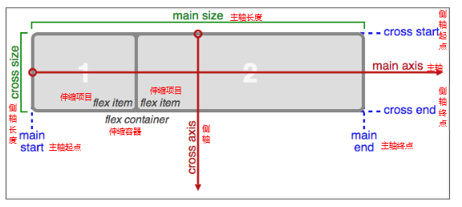

# Css3

# 1、 3d变换

```css
    rotateX(30deg) 绕着x旋转30deg
    rotateY(30deg) 绕着y旋转30deg
    rotateZ(30deg) 绕着z旋转30deg
    translateX(30px) 沿着x轴移动30px
    translatey(30px) 沿着y轴移动30px
    translatez(30px) 沿着Z轴移动30px( 必须给父盒子加透视)
```

 # 2、透视：
​        加给变换元素的父盒子， 设置的是用户眼睛和屏幕的距离；
​        只是视觉上的呈现，不是正真的3d
​        perspective:1000px;

 #  3、transform-style:preserve-3d;
​        加给变换元素的父盒子，让子盒子存在三维空间中，保持3d效果
​       flat:默认值 （让子盒子被扁平化）

# 4、 backface-visibility:hidden; 背面不可见


```css
skew(30deg,30deg);  2d变换 -倾斜

css3中获取自定义属性的值：content:attr(data-text);
```

  # 5、动画：
​      定义：
​        

```css
@keyframes 动画名{
        0%{

        }

        100%{

        }

        或者
        from{}
        to{}
    }

    动画调用：
        animation: 动画名称 动画时间  执行次数  运动曲线 延迟执行 结束后状态 是否反向；
            infinite: 无限次
            alternate: 反向执行
            forwards: 保持结束后的状态
            backwards: 保持动起开始前的状态
            steps(5): 让动画分步执行；

            动画详细属性：
                animation-name:动画名称
                animation-duration:持续时间
                animation-iteration-count:执行次数
                animation-timing-function:运动曲线
                animation-fill-mode:结束状态
                animation-direction: 动画方向
                animation-delay: 延迟时间
```


```css
            多列：（了解）
                -webkit-column-count:列数
                -webkit-column-rule:分割线样式
                -webkit-column-width:列宽
                -webkit-column-gap:列间距
                -webkit-column-span:跨列 all 跨所有列
```
## **6** **伸缩布局**

CSS3在布局方面做了非常大的改进，使得我们对块级元素的布局排列变得十分灵活，适应性非常强，其强大的伸缩性，在响应式开中可以发挥极大的作用。

如下图，学习新的概念：

主轴：Flex容器的主轴主要用来配置Flex项目，默认是水平方向

侧轴：与主轴垂直的轴称作侧轴，默认是垂直方向的

方向：默认主轴从左向右，侧轴默认从上到下

主轴和侧轴并不是固定不变的，通过flex-direction可以互换。



**1、必要元素：**

a、指定一个盒子为伸缩盒子 display: flex

b、设置属性来调整此盒的子元素的布局方式 例如 flex-direction

c、明确主侧轴及方向

d、可互换主侧轴，也可改变方向

2、各属性详解

a、flex-direction调整主轴方向（默认为水平方向）

**该属性通过定义flex容器的主轴方向来决定felx子项在flex容器中的位置**

row 水平方向

row- reverse 反转

column 垂直方向

column- reverse 反转列

b、justify-content**设置或检索弹性盒子元素在主轴（横轴）方向上的对齐方式。** 

flex-start、 起点对齐

flex-end、  终点对齐

center    中间对齐

space-around、 环绕

space-between  两端对齐

c、flex控制子项目的缩放比例

不指定flex 属性，则不参与分配

d、align-items**设置或检索弹性盒子元素在主轴（纵轴）方向上的对齐方式。** 

flex-start、 起点对齐

flex-end、  终点对齐

center    中间对齐

stretch:  拉伸;

 

此知识点重在理解，要明确找出主轴、方向，各属性对应的属性值可参考示例源码

应用场景1：


应用场景2:


 

应用场景3-携程旅行


 