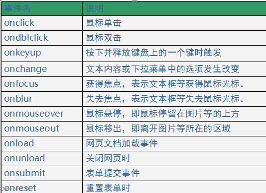
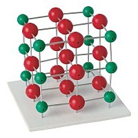
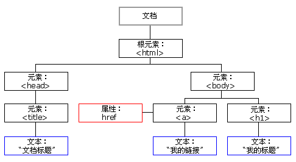

# 前端基本功—javascript

# 1事件

## 1.1   概述

JS是以事件驱动为核心的一门语言。

## 1.2   事件三要素

事件源、事件、事件驱动程序。

三句话：获取事件源、绑定事件、书写事件驱动程序。

获取事件源：document.getElementById(“box”);

绑定事件：  box.onclick = function(){ 程序 };

书写事件驱动程序：以后要学习的关于DOM的操作。

 

体验事件:

1.事件源（引发后续事件的标签）

2.事件（js已经定义好，直接使用）

3.事件驱动程序（对样式和html的操作）（DOM操作）

 cursor：pointer设定鼠标的形状为一只伸出食指的手，这也是绝大多数浏览器里面鼠标停留在网页链接上方时候的样式 , 另外可以选择其他鼠标指针样式，常用的有default 箭头，crosshair 十字，progress 箭头和沙漏等等.


需要掌握的 获取事件源的三种方式: 

```js
    var div = document.getElementById("box");

    var arr1 = document.getElementsByTagName("div");

	var arr2 = document.getElementsByClassName("leiming");
```

绑定事件的方法:

1.匿名绑定

2.用函数名绑定

3.行内绑定

可以操作标签的属性和样式:

​      

```js
div.className = "aaa"; 更改样式，也就是css代码中所写的哪个样式

div.style.width = "200px";

div.style.height = "200px";

div.style.backgroundColor = "red";
```

需求：点击盒子,改变盒子的宽高颜色等样式，并弹出对话框alert(1)

### 1.2.1    事件有哪些



## 1.3   案例

1.京东广告栏（类）

2.京东狗（src）（this）

3.手机京东（前两个结合）

# 2DOM概述

## 2.1   解析过程

HTML加载完毕，渲染引擎会在内存中把HTML文档，生成一个DOM树，getElementById是获取内中DOM上的元素节点。然后操作的时候修改的      是该元素的属性。

## 2.2  DOM   (文档对象模型)

document是文档对象模型的一部分。

DOM是一个复合的数据类型。



## 2.3   DOM的数据结构（树状）



## 2.4   HTML的组成部分为节点（ Node ）

在HTML当中一切都是节点……

由结构图中我们可以看到，整个文档就是一个文档节点。

每一个HMTL标签都是一个元素节点（标签）。

标签中的文字则是文字节点。（文本）

标签的属性是属性节点。（属性）

## 2.5  DOM节点的获得

操作节点，必须首先找到该元素。有三种方法来做这件事：

通过 id 找到 HTML 元素

```js
document.getElementById("demo");
```

通过标签名找到 HTML 元素

```js
document.getElementsByTagName("div");
```

通过类名找到 HTML 元素

```js
document.getElementsByClassName("a");
```

通过类名查找 HTML 元素在 IE 5,6,7,8 中无效

```js
标签=document.getElementById("demo"); 通过ID获得标签
```

他的返回值是一个标签，可以直接使用。获得属性值，设置属性。

```
标签数组= document.getElementsByTagName("div"); 通过标签名获得标签数组
```

```
标签数组= document.getElementsByClassName("a");通过类名获得标签数组
```

他们两个的返回值是标签数组，习惯性是遍历之后再使用。

特殊情况：数组中的值只有1个。      

​       document.getElementsByTagName("div")[0];取数组中第一个元素

​        document.getElementsByClassName("a")[0];取数组中第一个元素

## 2.6   DOM 访问关系（节点的获得）

节点的访问关系，是以属性的方式存在的。

DOM的节点并不是孤立的，因此可以通过DOM节点之间的相对关系对它们进行访问。

### 2.6.1    父节点  （ parentNode ）   

调用者就是节点。一个节点只有一个父节点。调用方式就是节点.parentNode.

案例：

1.通过子盒子设置父盒子的背景色。

2.关闭二维码

### 2.6.2    兄弟节点

sibling就是兄弟的意思。

Next：下一个的意思。

Previous:前一个的意思。

nextSibling：调用者是节点。IE678中指下一个元素节点（标签）。在火狐谷歌IE9+以后都指的是下一个节点（包括空文档和换行节点）。

nextElementSibling：在火狐谷歌IE9都指的是下一个元素节点。

总结：在IE678中用nextSibling，在火狐谷歌IE9+以后用nextElementSibling

```
下一个兄弟节点=节点.nextElementSibling || 节点.nextSibling
```

 

previousSibling：调用者是节点。IE678中指前一个元素节点（标签）。在火狐谷歌IE9+以后都指的是前一个节点（包括空文档和换行节点）。

previousElementSibling：在火狐谷歌IE9都指的是前一个元素节点。

总结：在IE678中用previousSibling，在火狐谷歌IE9+以后用previousElementSibling。

```
上一个兄弟节点=节点.previousElementSibling|| 节点.previousSibling
```


### 1.9.3    单个子节点

firstChild：调用者是父节点。IE678中指第一个子元素节点（标签）。在火狐谷歌IE9+以后都指的是第一个节点（包括空文档和换行节点）。

firstElementChild:在火狐谷歌IE9都指的第一个元素节点。

```
第一个子节点=父节点.firstElementChild || 父节点.firstChild
```

lastChild:调用者是父节点。IE678中指最后一个子元素节点（标签）。在火狐谷歌IE9+以后都指的是最后一个节点（包括空文档和换行节点）。

lastElementChild：在火狐谷歌IE9都指的最后一个元素节点。

```
最后一个子节点=父节点.lastElementChild|| 父节点.lastChild
```


### 1.9.4    所有子节点

childNodes：它是标准属性，它返回指定元素的子元素集合，包括HTML节点，所有属性，文本节点   （他还是W3C的亲儿子 ）

火狐 谷歌等高本版会把换行也看做是子节点

nodeType==1时才是元素节点(标签)

​      nodeType  ==  1  表示的是元素节点   记住   元素就是标签

​      nodeType  ==  2  表示是属性节点   了解

​      nodeType  ==  3  是文本节点   了解

```
子节点数组 = 父节点.childNodes;   获取所有节点。
```

children：非标准属性，它返回指定元素的子元素集合。

但它只返回HTML节点，甚至不返回文本节点，虽然不是标准的DOM属性，但它和innerHTML方法一样，得到了几乎所有浏览器的支持。

children在IE6/7/8中包含注释节点 

在IE678中，注释节点不要写在里面。

```
子节点数组 = 父节点.children;   用的最多。
```


### 1.9.5    知识补充

```
节点自己.parentNode.children[index];随意得到兄弟节点。
```

作为了解内容：

```js
function siblings(elm) {

    var a = [];

    var p = elm.parentNode.children;

    for(var i =0,pl= p.length;i<pl;i++) {

        if(p[i] !== elm) a.push(p[i]);

     }

     return a;

}
```

定义一个函数。必须传递自己。定义一个数组，获得自己的父亲，在获得自己父亲的所有儿子（包括自己）。遍历所有的儿子，只要不是自己就放进数组中。

### 2.6.6    要明白两个属性（！！！重点！！！）

parentNode   和  children  这两个属性。

## 2.7     DOM节点操作 （！！！！！重点！！！！！）

节点的访问关系都是属性。节点的操作都是函数或者方法。

### 2.7.1 创建节点

使用方法是这样的document.createElement();

```
新的标签（节点） = document.createElement(“标签名”);
```


### 2.7.2 插入节点（使用节点）

使用方法： 父节点.appendChild();

```
父节点.appendChild(新节点); 父节点的最后插入一个新节点
```

使用方法：父节点.insertBefore(要插入的节点，参考节点)；

```
父节点.insertBefore(新节点,参考节点)在参考节点前插入;
```

如果参考节点为null，那么他将在节点最后插入一个节点。

### 2.7.3 删除节点   

用法：用父节点删除子节点。

```
父节点.removeChild（子节点）；必须指定要删除的子节点
```

节点自己删除自己：

不知道父级的情况下，可以这么写：node.parentNode.removeChild(node)

### 2.7.4 复制节点 （    oldNode.cloneNode（true）  ）

想要复制的节点调用这个函数cloneNode()，得到一个新节点。 方法内部可以传参，如果是true，深层复制，如果是false，只复制节点本身。

```
新节点=要复制的节点.cloneNode(参数) ; 参数可选复制节点
```

用于复制节点， 接受一个布尔值参数， true 表示深复制（复制节点及其所有子节点）， false 表示浅复制（复制节点本身，不复制子节点）

### 2.7.5 节点属性（节点.属性）

两种方法:

```html

```

1.属性节点获取          节点.属性 = 值;

2.

获取：getAttribute(名称)

设置：setAttribute(名称, 值)

删除：removeAttribute(名称)

注意：IE6、7不支持。

调用者：节点。   有参数。   没有返回值。

每一个方法意义不同。

# 3.DOM详解（属性操作）

## 3.1      DOM元素

DOM就是html文档的模型抽象。数据以树的形式在内存中排列。

节点就是DOM的组成。是一个对象，有属性和方法。获取方式有很多种。

节点分为元素节点（标签），文本节点，属性节点。

区分方法：nodeType: 1是标签,2是属性,3是文本

 

## 3.2     案例

href=”#” è href=”javascript:;”

1.切换图片（a连接+图片）

2.显示和隐藏盒子

3.美女相册（placehold.it网站,获取 xxx * xxx 大小的图片）

## 3.3      value和innerHTML和innerText和textContent

​    1.老版本的火狐不支持innerText，支持textContent

​    2.p不能嵌套p。h1不能嵌套h1。a连接内部不能嵌套a连接