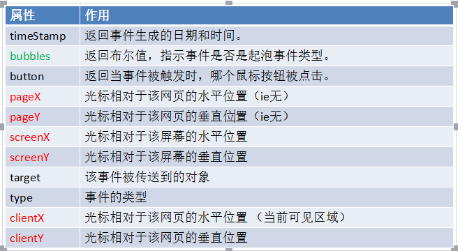
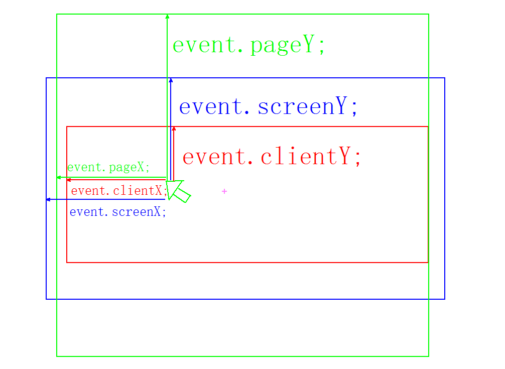
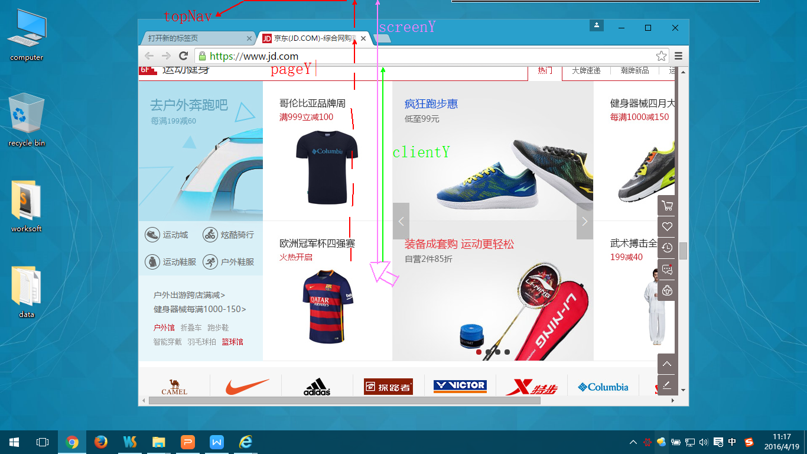

 

# 前端基本功—javascript 

## 今日内容：

 案例：楼层跳跃

 事件对象（event）

 案例

 鼠标跟随、显示鼠标坐标、放大镜、拖拽、模拟滚动条

 

# 1 scroll家族

## 1.1   案例

### 1.1.1    楼层跳跃

100%子盒子会继承父盒子的宽高。父盒子继承body宽高。body继承html的宽高。

盒子属性：auto:适应盒子自身的宽度或者高度。（对自己负责）

盒子属性：100%:适应盒子父盒子的宽度或者高度。（对爸爸负责）

# 2 事件对象（event）

在触发DOM上的某个事件时，会产生一个事件对象event，这个对象中包含着所有与事件有关的信息。所有浏览器都支持event对象，但支持的方式不同。

比如鼠标操作时候，会添加鼠标位置的相关信息到事件对象中。（类似Date）

普通浏览器支持 event（带参，任意参数）

ie 678 支持 window.event（无参，内置）

总结：他是一个事件中的内置对象。内部装了很多关于鼠标和事件本身的信息。

 

## 2.2   事件对象的获取（event的获取）

IE678中，window.event 

在火狐谷歌中，event或者，在事件绑定的函数中，加参，这个参数就是event.

  box.onclick = function (aaa){   aaa就是event     }

## 2.3   兼容获取方式有两种：

不写参数直接使用event;

写参数，但是为event....

var event  = event || window.event;(主要用这种)

## 2.4   event内容重要内容



 

## 2.5   screenX、pageX和clientX的区别



 



 

pageY/pageX: 鼠标位于整个网页页面的顶部和左侧部分的距离。（页面）

screenY/screenX: 鼠标位于屏幕的上方和左侧的距离。（屏幕）

clientX/clientY: 鼠标位于浏览器的左侧和顶部的距离。（浏览器大小和位置）

## 2.6   pageY和pageX的兼容写法（低版本不支持,很重要）

在页面位置就等于 = 看得见的+看不见的

```js
pageY/pageX=event.clientY/clientX+scroll().top/scroll().left
```


## 2.7   新事件（onmousemove）

只要鼠标在绑定该事件的事件源上移动，哪怕1像素，也会触动这个事件。

（这个事件可以直接或者间接的替代定时器）

 

点击鼠标跟随

鼠标在盒子中的位置

## 2.8   案例

### 1.8.1    放大镜

注意1：CSS部分要注意：大图片/大盒子 = 小图片/显示部分

注意2：(大图片/大盒子 = 小图片/黄盒子)

大盒子滑动的距离/小盒子滑动的距离  = 大盒子滑倒头/小盒子滑倒头

大盒子滑倒头/小盒子滑倒头（他们的距离如何获取呢？）

```
（大图片-大盒子）（两边各有一伴儿大盒子的距离是没有走的）
（小盒子-小图片）（两边各有一伴儿小盒子的距离是没有走的）
```

注意3：

onmouseover、onmouseout事件给定一个盒子，子元素也会获取这个事件。

替代方法：onmouseenter和onmouseleave.

//禁止文本选中（选中后取消）

window.getSelection ? window.getSelection().removeAllRanges() : document.selection.empty();

### 

 