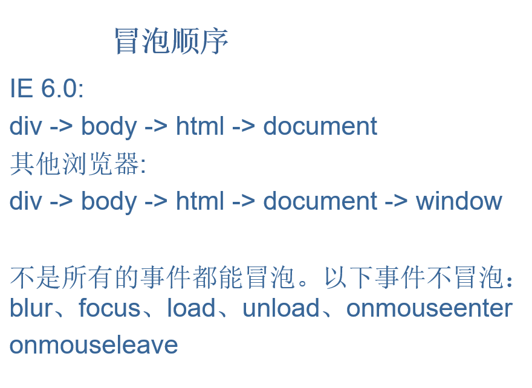
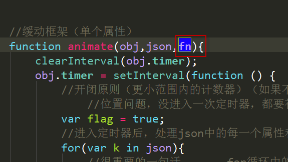
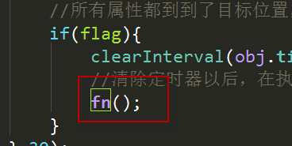

 

# 前端基本功—javascript

今日内容：

 client家族

 冒泡

 案例：点击空白处隐藏模态框/事件委托

 缓动框架

 案例：360广告向下关闭/手风琴

# 1 第三大家族client

## 1.1   主要成员

1、clientWidth   获取网页可视区域宽度（两种用法）

   clientHeight  获取网页可视区域高度（两种用法）

​     调用者不同，意义不同：

​                     盒子调用：               指盒子本身。

​                      body/html调用：      可视区域大小。  

2、clientX       鼠标距离可视区域左侧距离（event调用）

   clientY       鼠标距离可视区域上侧距离（event调用）

3、clientTop/clientLeft       盒子的border宽高

## 1.2   三大家族区别（三大家族总结）

### 1.2.1    Width和height

```js
clientWidth  = width  + padding

clientHeight  = height + padding

offsetWidth  = width  + padding + border

offsetHeight  = height + padding + border

scrollWidth   = 内容宽度（不包含border）

scrollHeight  = 内容高度（不包含border）
```

### 1.2.2    top和left

offsetTop/offsetLeft ：

​          调用者：任意元素。(盒子为主)

​          作用：距离父系盒子中带有定位的距离。

scrollTop/scrollLeft:(盒子也可以调用，必须有滚动条)

​          调用者：document.body.scrollTop/.....(window)

​          作用：浏览器无法显示的部分（被卷去的部分）。

clientY/clientX:（clientTop/clientLeft 值的是border）

​          调用者：event.clientX(event)

​          作用：鼠标距离浏览器可视区域的距离（左、上）。

## 1.3   client家族特殊用法之:检浏览器宽/高度(可视区域)

```js
function client() {
        if(window.innerWidth!= undefined){
            return{
                width:window.innerWidth,
                height:window.innerHeight
            }
        }else if(document.compatMode=== "CSS1Compat"){
            return{
                width:document.documentElement.clientWidth,
                height:document.documentElement.clientHeight,
            }
        }
        return{
            width:document.body.clientWidth,
            height:document.body.clientHeight
        }
}
```


## 1.4   Onresize事件

只要浏览器的大小改变，哪怕1像素，都会触动这个事件。

## 1.5   案例：根据浏览器可视区域大小，给定背景色

## 1.6   事件总结

区分：

​    1.window.onscroll          屏幕滑动

​    2.window.onresize            浏览器大小变化

​    3.window.onload           页面加载完毕

​    4.div.onmousemove            鼠标在盒子上移动（注意：不是盒子移动！！！）

  5.onmouseup/onmousedown  ==  onclick

## 1.7   获得屏幕宽高

window.screen.width

分辨率是屏幕图像的精密度，指显示器所能显示的像素有多少。

我们的电脑一般：

横向1280个像素点，

纵向960个像素点。

我们看电影的时候是满屏和半屏的，就是这。

# 2 冒泡

事件冒泡: 当一个元素上的事件被触发的时候，比如说鼠标点击了一个按钮，同样的事件将会在那个元素的所有祖先元素中被触发。这一过程被称为事件冒泡；这个事件从原始元素开始一直冒泡到DOM树的最上层。(BUG)

（本来应该一人做事一人当，结果，我做错了事情，你去告诉我妈）

什么是冒泡：子元素事件被触动，父盒子的同样的事件也会被触动。

取消冒泡就是取消这种机制。

## 2.1   阻止冒泡

w3c的方法是：（火狐、谷歌、IE11）

​    event.stopPropagation()

IE10以下则是使用：event.cancelBubble = true

兼容代码如下：

```js
  var event = event || window.event;

 if(event && event.stopPropagation){

      event.stopPropagation();

  }else{

      event.cancelBubble = true;

  }
```


## 2.2   addEventListener(参数1，参数2，参数3)

调用者是：事件源。                参数1：事件去掉on   参数2 ：调用的函数

参数3：可有可无。没有默认false.false情况下，支持冒泡。true支持捕获。

```js
//这个方法就是用来绑定事件用的
document.addEventListener("click",fn,false);//false支持冒泡,true支持捕获
function fn(){
    alert(1);
}
```



```js
//兼容获取事件触动时，被传递过来的对象

//  var aaa = event.target || event.srcElement;

   var aaa = event.target?event.target:event.srcElement;
```


## 2.3     案例

### 2.3.1  点击空白隐藏模态框

Document事件的绑定，无论绑定什么事件，只要事件被出发，传递过来的应该是指定的元素本身，而不是document。

### 2.3.2  事件委托

 

# 3 缓动框架

## 3.1      封装框架遇到的两个问题

原有的方法：div.style.width :这个方法比较固定，不能用变量或者字符串的形式更换属性，不方便我传值获取属性，和给属性赋值。

属性值的获取和属性的赋值

```js
div.style["width"] = "5000px";
```

可以通过传字符串或者变量的方式获取和赋值属性。

缺点：他的操作完全是对行内式CSS来操作的。赋值的时候毫无问题。但是，获取值的时候有问题了。

## 3.2      获取任意类型的CSS样式的属性值

```js
div.style.width    

div.currentStyle.width

Window.getComputedStyle(div,null).width;
```

他们的公共使用变量或者字符串获取属性值的方法都是：去掉属性和点，然后加上中括号和属性的字符串形式。

```js
div.style[“width”];

div.currentStyle[“width”];

Window.getComputedStyle(div,null)[“width”];
```

 

## 3.3      开闭原则

定义一个变量。数据可以修改。但是，只能修改成为两个值。

```js
//开闭原则(更小范围内的计算器)(如果不说话，我可清除定时器了啊)
    //位置问题，每进入一次定时器，都要初始化一次flag(控制定时器的参数)
    var flag = true;
        //不会的举手！(没到达目标位置的说话，告诉程序不允许清除定时器)
        if(leader != json[k]){
            flag = false;
        }
    }
    //所有属性都到达了目标位置，才清除定时器
    if(flag){
        clearInterval(obj.timer);
        //清除定时器以后，在执行fn这个函数
        fn();
    }
```

 

## 3.4     回调函数

程序执行完毕，在次执行的函数。

在函数中给指定的函数定义一个形参，然后程序执行到最后，调用这个形参后面加一个括号。



 

## 3.5      案例（缓动框架的应用）

### 3.5.1  手风琴案例

鼠标放上去的时候，该li变大的速度太快，而其他的li变小的速度没有跟上。导致盒子右侧出现了空白。

### 3.5.2  360关闭广告