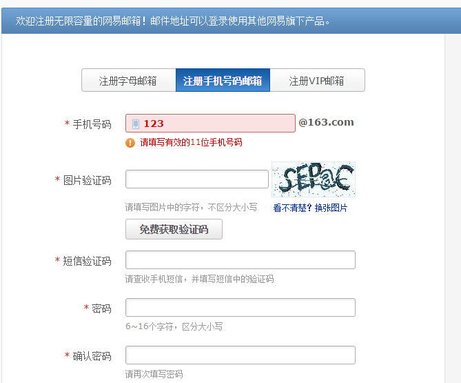
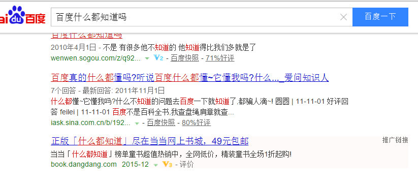
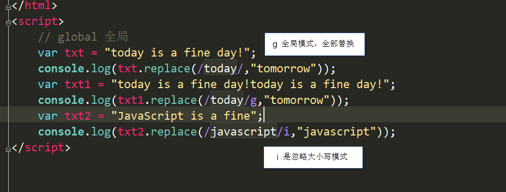

 

# 前端基本功—javascript

今日内容：

 缓动框架（透明度/层级）

 旋转木马

 正则

# 1 缓动框架

## 1.1   存在的问题

很多属性我们的框架无法获取值和赋值。

```js
border-radius: 1px  21px  41px  1px ;

opacity: 0.5;

background: rgba(0,0,0,.4);

z-index: 1;
```


## 1.2   主要处理两个

### 1.2.1    第一个是透明度（旋转木马）

1.值为小数，获取的时候要特殊处理。

2.兼容问题。IE678不识别opacity;

```
ele.style.filter = "alpha(opacity="+leader+")";//兼容IE678
```

 

### 1.2.2    第二个是层级（旋转木马）（由需求决定的）

层级的提高是一次性直接提到最高，不需要一点一点儿的缓动。

# 2 缓动框架案例

## 1.3   旋转木马

原理：我们先定义一个数组，数组中的元素是json；json中的元素是属性。

点击一个按钮，按顺序更换数组中元素的位置。

（如果我们想完成旋转木马，只需要更换数组中元素的位置）

```
步骤：

1.我们必须让页面加载的时候把所有的属性加载出来，让我看看。（核心）

2.鼠标放到大盒子上显示对应的左右切换按钮，移开隐藏

3.获取两个按钮。对他们进行事件绑定。对他们进行判断。

4.如果是左侧的按钮执行一套程序，如果是右侧的按钮执行另一套程序。

5.绑定按钮的函数，一个是正转，一个是反转。（传参确定）

6.调换相应的数组对应的元素。（先删除谁，在怎么添加）
```


### 2.1.1    正转反转的问题

最开始是：12345；我想让他变成：23451

把1删除，在最后添加1；

在数组json中，删除第一个元素，添加到最末尾。（正转）

在数组json中，删除最后一个元素，添加到第一位。（反转）

### 1.3.2    函数节流

定义一个变量，只有函数执行完毕在去执行下一个。

# 3正则表达式（RegExp）

## 1.4   概述

正则表达式（英语：Regular Expression）

本质：用来记录文本规则的代码

（为字符串定义规则，为输入内容定义规则！）      

应用非常广泛，如：表单验证、高级搜索、生化科学      

（有一定难度，不要求非常熟练，但至少会表单验证） 

**1.表单验证**



2. 隐藏手机号码：  150****7654 

3. 可以通过正则表达式，从字符串中获取我们想要的特定部分



## 1.5   正则表达式的特点是：

1. 灵活性、逻辑性和功能性非常的强；

2. 可以迅速地用极简单的方式达到字符串的复杂控制。

3. 对于刚接触的人来说，比较晦涩难懂。

比如：

匹配国内电话号码：

```
\d{3}-\d{8}|\d{4}-\d{7}
```

验证手机号：

```
/^((13[0-9])|(15[^4,\D])|(18[0,5-9]))\d{8}$/   
```

很难记住。

## 1.6   正则表达式声明

### 1.6.1    1.通过构造函数定义 

```js
var 变量名= new RegExp(/表达式/);  
```


### 1.6.2    2.通过直接量定义  （较为常用）

```js
var 变量名= /表达式/;

  console.log(regexp1.test(345));

  console.log(/\d/.test(567));（直接使用）
```


### 3.3.3    正则表达式的组成是：(总结)

有一些普通字符和元字符组成，普通字符就是字母和数字，元字符具有特殊意义的字符

匹配腾讯QQ号：[1-9][0-9]{4,}

评注：腾讯QQ号从10000开始 

比如  \d

预定义类: 表示数字   [0-9]

## 1.7   test() 方法          

正则对象方法，检测测试字符串是否符合该规则，返回true和false，参数（测试字符串） 

使用语法：  

```
   Boolean = 表达式.test("要验证的内容");  
```

 

```js
console.log(/\d/.test(567));
```

 验证  567 符不符合 \d 的规范

 

## 1.8   正则内部类（帮我们写好的工具直接使用）

### 3.5.1    预定义类                                                       

```js
 .    [^\n\r]  除了换行和回车之外的任意字符（“”不行）

 \d     [0-9]          数字字符

 \D    [^0-9]     非数字字符

 

 \s     [ \t\n\x0B\f\r]    空白字符 

 \S     [^ \t\n\x0B\f\r]  非空白字符

 

 \w    [a-zA-Z_0-9]          单词字符

 \W   [^a-zA-Z_0-9]     非单词字符  
```


### 1.8.2    简单类（正则：//中什么特殊符号都不写，和[]的加入）

```js
1、/string/.test(“string”);            必须是完整的，只多不能少

/andy/.test(“andy”)                          // true

/andy/.test(“andylv”)                      // true

/andy/.test(“an”)                             // false

一句话，只要完整包含了andy 就可以了（有他就行）

2、/[string]/.test(“string”);                    只要包含里面的任何一个就可以

  /[andy]/.test("andy");                        // true

  /[andy]/.test("an");                              // true

  /[andy]/.test("ady");                        // true

  /[andy]/.test("anll");                        // true

  /[andy]/.test("assd");                       // true

  /[andy]/.test("ss");                           // false

 /[3aH8]/.test("ss");                          // false
```


### 1.8.3    负向类（不能是其中的整体或者一部分）

中括号内，前面加个元字符^进行取反，不是括号里面的字符（一部分也不行）。

(可以不够，但是不能多)（不够和正好，返回false；多了或者没有返回true）

```js
 console.log(/[^abc]/.test('a'));

 console.log(/[^abc]/.test('gg'));
```

注意:  这个符号 ^  一定是写到方括号里面

### 1.8.4    范围类

有时匹配的东西过多，而且类型又相同，全部输入太麻烦，我们可以在中间加了个横线

```js
console.log(/[a-z]/.test('1111'));

console.log(/[A-Z]/.test('aa'));
```


### 1.8.5    组合类

用中括号匹配不同类型的单个字符。

```js
console.log(/[a-m1-5]/.test("b"))//true
```


## 3.6   正则边界（重点）

^ 会匹配行或者字符串的起始位置

注：^在[]中才表示非！这里表示开始

$ 会匹配行或字符串的结尾位置

^$在一起 表示必须是这个（精确匹配）

```js
// 边界可以精确说明要什么
console.log(/lily/.test("lilyname")); // true
console.log(/^lily$/.test("lily"));  // true
console.log(/^lily$/.test("ly"));   // false
```

 

console.log(/^andy$/.test("andy"));  // true

 这个的最终意思就是 说， 必须是 andy 这四个字母

## 3.7      量词（重点）

（多个字母，重复最后一个）

 \*   (贪婪)   重复零次或更多   (>=0)

 \+   (懒惰)   重复一次或更多次  (>=1)

 ?    (占有)   重复零次或一次   （0||1）  要么有 要么没有

{}	重复多少次的意思   可以有多少个  

您的银行卡密码只能是 6位      {6}

{n}    n次     （x=n）  

{n,}   重复n次或更多  (x>=n)

{n,m} 重复出现的次数比n多但比m少 (n<=x<=m)

\*      {0,}

\+      {1,}

?      {0,1}

 

x|y    一个 |   x  或者 y（没有&，用的是，代替的）   

（）提高权限，有限计算

## 3.8      案例：

1.匹配座机号

```js
var regexp  = / (^0\d{2}-\d{8}$)|(^0\d{3}-\d{7}$)/;
var demo    = /^0\d{2}-\d{8}$|^0\d{3}-\d{7}$/;
```

2.匹配中文

```js
（     /^[\u4e00-\u9fa5]{2,4}$/     ）
```

3.匹配验证表单（注册QQ）

 

## 3.9     replace 函数

replace() 方法用于在字符串中用一些字符替换另一些字符，或替换一个与正则表达式匹配的子串。

语法格式：(返回值是新字符串)

需要匹配的对象.replace(正则式/字符串，替换的目标字符)

 

正则表达式的匹配模式支持的2个标志

   g：表示全局模式（global），即模式将被应用于所有字符串而非发现一个而停止

  

   i：表示不区分大小写（ease-insensitive）模式，在确定匹配想时忽略模式与字符串的大小写



### 3.9.1 封装自己的trim 函数

 

```js
function trim(str) {

       return str.replace(/（^\s+）|（\s+$）/g,"");  // 去掉前面和后面的空格

}
```

 