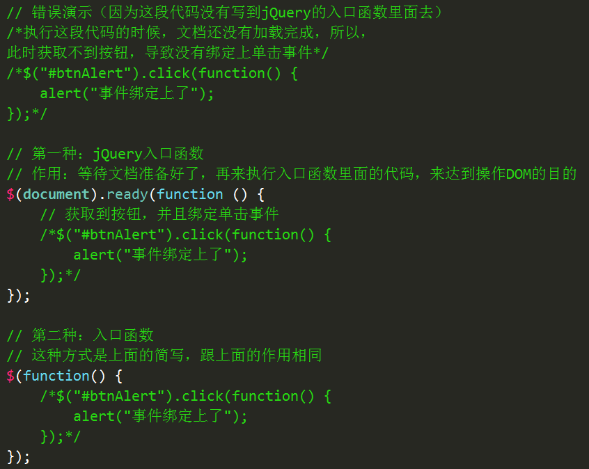

# jQuery 基础课程—jQuery选择器

## **为什么要学jQuery？**

### **学习JS的遇到的痛点**

痛点的总结：


## **1.1** **jQuery是什么？**

### **1.1.1** **jQuery描述（理解）**

jQuery是js的一个库，封装了我们开发过程中常用的一些功能，方便我们来调用，提高了我们的开发效率。

Js库是把我们常用的功能放到一个单独的文件中，我们用的时候，直接引用到页面里面来就可以了。

animate.js(JQurey.js)是我们自己封装的库，而jQuery是别人帮我们封装好的库。

### **1.1.2** **学习jQuery，主要是学什么呢？**

目前这个阶段，主要学习如何来使用jQuery操作DOM，其实就是学习jQuery封装好的那些功能方法，这些方法叫做API（Application Programming Interface应用程序编程接口）。

这些API的共同特点是：几乎全都是方法。所以，在使用jQuery的API时，都是方法调用，也就是说要加小括号()，小括号里面是相应的参数，参数不同，功能不同。

### **1.1.3** **体验JQuery**

JS实现显示盒子，设置文字。

JQ实现显示盒子，设置文字。

## **1.2** **如何使用jQuery？（**重点**）**

使用步骤： 


1．引包

2．入口函数

3．功能实现代码（事件处理）

 

jQuery隐式迭代简单介绍：（了解）

​	隐式 对应的是 显示，隐式迭代的意思是：在方法的内部进行循环遍历，而不用我们自己再进行循环，简化我们的操作，方便我们调用。

 

## **1.3** **jQuery详细解释**

### **1.3.1** **版本介绍（了解）**


两个版本的区别：2.x版本，不再支持IE6、7、8

两个版本对浏览器的支持情况：


 

这几天主要学习1.x版本，1.x版本说明：


同版本两个文件的区别：

min：压缩版，压缩过后，体积会更小

压缩指的是：把注释、空格、换行全部去掉，把变量名称尽可能的换成更加简短的字符。

压缩的主要目的：就是让文件变的更小。

平时开发过程中，这两个文件使用哪个都可以；但是，项目上线的时候，推荐使用压缩版。

 

### **1.3.2** **引包注意点（理解）**

第一点：在使用jQuery之前，先把jQuery文件引到页面中来

​	如果在使用jQuery之前，没有引用jQuery文件，会报错：


第二点：src路径一定要写正确

​	如果src路径写错，也会报错：


 

### **1.3.3** **jQuery的入口函数（重点）**



 

### **1.3.4** **jQuery入口函数与js入口函数的区别（理解）**

js入口函数指的是：window.onload = function() {};

 

区别一：书写个数不同

​	Js入口函数只能出现一次，出现多次会存在事件覆盖的问题。

​	jQuery的入口函数，可以出现任意多次，并不会存在事件覆盖问题。

区别二：执行时机不同

​	Js入口函数是在所有的文件资源加载完成后，才执行。这些文件资源包括：页面文档、外部的js文件、外部的css文件、图片等。

​	jQuery的入口函数，是在文档加载完成后，就执行。文档加载完成指的是：DOM树加载完成后，就可以操作DOM了，不用等到所有的外部资源都加载完成。

​	

​	文档加载的顺序：从上往下，边解析边执行。

 

### **1.3.5** **jQuery的$符号（重点）**

js命名规范允许出现的字符有：数字、字母、下划线、$。

js命名规范允许作为变量命名开头的字符有：字母、下划线、$；但是，不允许以数字作为变量命名的开头。

 

```js
var $ = “我是字符串”;

var $ = 123;

function $(){

	alert(“我是函数$”);

}
```

 

jQuery使用$符号原因：书写简洁、相对于其他字符与众不同、容易被记住。


怎么理解jQuery里面的$符号：

$实际上表示的是一个函数。

```
$(); // 调用上面我们自定义的函数$

$(document）.ready(function(){}); // 调用入口函数

$(function(){}); // 调用入口函数

$(“#btnShow”) // 获取id属性为btnShow的元素

$(“div”) // 获取所有的div元素
```

jQuery里面的$函数，根据传入参数的不同，进行不同的调用，实现不同的功能。返回的是jQuery对象

 

jQuery这个js库，除了$之外，还提供了另外一个函数：jQuery

jQuery函数跟$函数的关系：jQuery ===$;

### **1.3.6** jQuery对象和DOM对象的相互转换（难点）

DOM对象此处指的是：使用js操作DOM返回的结果。

```js
var btn = document.getElementById(“btnShow”); // btn就是一个DOM对象
```

jQuery对象此处指的是：使用jQuery提供的操作DOM的方法返回的结果。

jQuery拿到DOM对象后又对其做了封装，让其具有了jQuery方法的jQuery对象，说白了，就是把DOM对象重新包装了一下。

（联想：手机和有手机壳的手机，手机就好比是DOM对象，有手机壳的手机就好比是jQuery对象）

```js
var $btn = $("#btnShow"); // $btn就是一个jQuery对象
```

DOM对象转换成jQuery对象：

```js
var $btn1 = $(btn); // 此时就把DOM对象btn转换成了jQuery对象$btn1

// $(document）.ready(function(){}); // 调用入口函数

// 此处是将document这个js的DOM对象，转换成了jQuery对象，然后才能调用jQuery提供的方法：ready

 
```

jQuery对象转换成DOM对象：

```js
// 第一种方式

var btn1 = $btn[0]; // 此时就把jQuery对象$btn转换成了DOM对象btn1 （推荐使用此方式）

// 第二种方式

var btn2 = $btn.get(0);// 此时就把jQuery对象$btn转换成了DOM对象btn2
```

这两种方式都要记住，使用哪一种都可以。

案例：隔行变色

案例：开关灯

图解：


所有这些，都体现了jQuery对js的封装！

## **1.4** **JS跟jQuery的区别是什么？（理解）**


## **1.5** **为什么要学jQuery选择器？**

### **1.5.1** **JS提供的选择DOM元素的方法有几个？**

考虑兼容性的话，js里面提供的选择DOM的方法只有两个：

| **JavaScript选择元素的方法：**       |                                                           |
| ------------------------------------ | --------------------------------------------------------- |
| **document.getElementById();**       | 通过id属性获取指定元素返回唯一的DOM对象                   |
| **document.getElementsByTagName();** | 通过标签名获取指定元素返回DOM对象数组（即使只有一个元素） |

正是因为js提供的选择DOM的方法太少了，满足不了我们平时开发的需要，所以，我们可以使用jQuery选择器来弥补这方面的不足。

### **1.5.2** **什么是jQuery选择器**

jQuery选择器是jQuery强大的体现，它提供了一组方法，让我们更加方便的获取到页面中的元素。（联想：CSS选择符）

 

## **1.6** **强大的jQuery选择器（重点）**

强大的原因：jQuery实现了从CSS1到CSS3所有的选择器以及其他常用的选择器。

各种选择器之间可以相互代替，所以，平时真正用到的只是最常用的选择器。

### **1.6.1** 基本选择器（重点）

| **符号(名称)** | **说明**   | **用法**                                                     |
| -------------- | ---------- | ------------------------------------------------------------ |
| **#**          | Id选择器   | $(“#btnShow”).css(“color”, “red”);选择id为btnShow的一个元素（返回值为jQuery对象，下同） |
| **.**          | 类选择器   | $(“.liItem”).css(“color”, “red”);选择含有类liItem的所有元素  |
| **element**    | 标签选择器 | $(“li”).css(“color”, “red”);选择标签名为li的所有元素         |

 

### **1.6.2** 层级选择器（重点）、基本过滤选择器

| **符号(名称)**     | **说明**                                                | **用法**                                                     |
| ------------------ | ------------------------------------------------------- | ------------------------------------------------------------ |
| **层级选择器**     |                                                         |                                                              |
| **空格**           | 后代选择器                                              | $(“#j_wrap li”).css(“color”, “red”);选择id为j_wrap的元素的所有后代元素li |
| **>**              | 子代选择器                                              | $(“#j_wrap > ul > li”).css(“color”, “red”);选择id为j_wrap的元素的所有子元素ul的所有子元素li |
| **基本过滤选择器** |                                                         |                                                              |
| **:eq(index)**     | 选择匹配到的元素中索引号为index的一个元素，index从0开始 | $(“li:eq(2)”).css(“color”, ”red”);选择li元素中索引号为2的一个元素 |
| **:odd**           | 选择匹配到的元素中索引号为奇数的所有元素，index从0开始  | $(“li:odd”).css(“color”, “red”);选择li元素中索引号为奇数的所有元素 |
| **:even**          | 选择匹配到的元素中索引号为偶数的所有元素，index从0开始  | $(“li:odd”).css(“color”, “red”);选择li元素中索引号为偶数的所有元素 |

 

 

### **1.6.3** 筛选选择器（方法）（重点）

| **符号(名称)**     | **说明**                                            | **用法**                                                     |
| ------------------ | --------------------------------------------------- | ------------------------------------------------------------ |
| **find(selector)** | 查找指定元素的所有后代元素（子子孙孙）              | $(“#j_wrap”).find(“li”).css(“color”, “red”);选择id为j_wrap的所有后代元素li |
| **children()**     | 查找指定元素的直接子元素（亲儿子元素）              | $(“#j_wrap”).children(“ul”).css(“color”, “red”);选择id为j_wrap的所有子代元素ul |
| **siblings()**     | 查找所有兄弟元素（不包括自己）                      | $(“#j_liItem”).siblings().css(“color”, “red”);选择id为j_liItem的所有兄弟元素 |
| **parent()**       | 查找父元素（亲的）                                  | $(“#j_liItem”).parent(“ul”).css(“color”, “red”);选择id为j_liItem的父元素 |
| **eq(index)**      | 查找指定元素的第index个元素，index是索引号，从0开始 | $(“li”).eq(2).css(“color”, “red”);选择所有li元素中的第二个   |

案例：隔行变色。

下拉菜单（this）

鼠标进入高亮（隔行变色）

突出展示案例

手风琴

淘宝精品服饰

css();hide();show()

index();过去当前元素在父元素中的索引值（解放自定义属性）