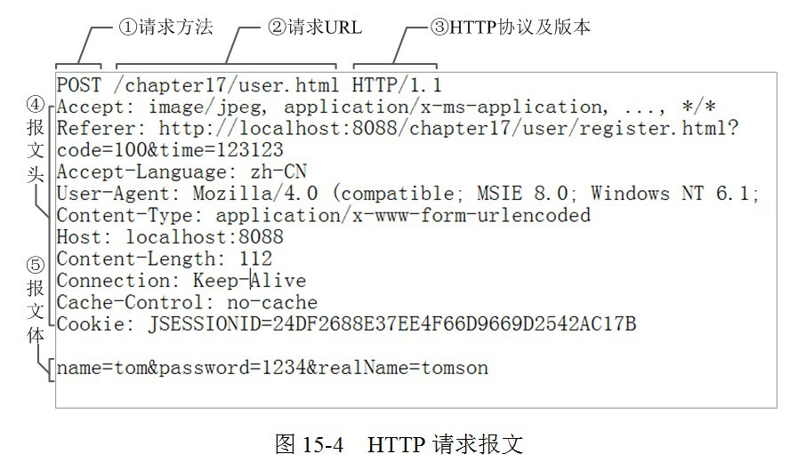
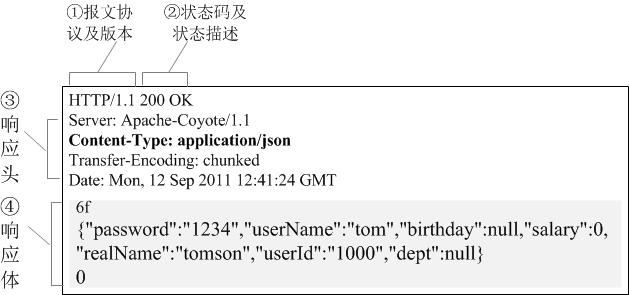
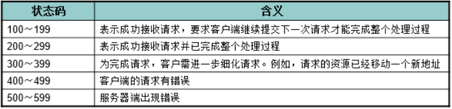

# **第二天 Ajax**

## **常见网络传输协议**

协议可以理解为一套规范,当使用的双反都遵守这套规范时,才能够实现沟通.比如对于嘿嘿的理解不同,带来的沟通障碍.网络协议就有更多规则,需要先干什么,再干什么

常见协议

HTTP,HTTPS超文本传输协议

FTP文件传输协议

SMTP邮件传输协议

## **HTTP协议**

网站是基于HTTP协议的,比如我们在开发网站中经常使用的css,js,图片等等都是基于该协议进行传输的

组成部分

从客户端(能够发送HTTP)发出的:请求Request

从服务器返回的:响应Response

### **监测工具**

使用监测工具我们可以查看这些HTTP请求,以及编辑请求内容,重新发送等

浏览器

Chrome,Firefox开发工具

抓包工具

Fiddler,Charles

### **请求/请求报文**

请求有客户端发出,主要有三个组成部分:请求行,请求头,请求主体



 **请求行:**

请求方法:GET

请求URL

HTTP协议版本

**请求头**:

这里设置的主要是一些信息,包含客户端,服务器

```
User-Agent：浏览器的具体类型　　如：User-Agent：Mozilla/5.0 (Windows NT 6.1; rv:17.0) Gecko/20100101 Firefox/17.0

Accept：浏览器支持哪些数据类型　　如：Accept: text/html,application/xhtml+xml,application/xml;q=0.9;

Accept-Charset：浏览器采用的是哪种编码　　如：Accept-Charset: ISO-8859-1

Accept-Encoding：浏览器支持解码的数据压缩格式　　如：Accept-Encoding: gzip, deflate

Accept-Language：浏览器的语言环境　　如：Accept-Language zh-cn,zh;q=0.8,en-us;q=0.5,en;q=0.3

Host：请求的主机名，允许多个域名同处一个IP地址，即虚拟主机。Host:www.baidu.com

Connection：表示是否需要持久连接。Keep-Alive/close，HTTP1.1默认是持久连接，它可以利用持久连接的优点，当页面包含多个元素时（例如Applet，图片），显著地减少下载所需要的时间。要实现这一点，Servlet需要在应答中发送一个Content-Length头，最简单的实现方法是：先把内容写入ByteArrayOutputStream，然后在正式写出内容之前计算它的大小。如：Connection: Keep-Alive

Content-Length：表示请求消息正文的长度。对于POST请求来说Content-Length必须出现。

Content-Type：WEB服务器告诉浏览器自己响应的对象的类型和字符集。例如：Content-Type: text/html; charset='gb2312'

Content-Encoding：WEB服务器表明自己使用了什么压缩方法（gzip，deflate）压缩响应中的对象。例如：Content-Encoding：gzip

Content-Language：WEB服务器告诉浏览器自己响应的对象的语言。

Cookie：最常用的请求头，浏览器每次都会将cookie发送到服务器上，允许服务器在客户端存储少量数据。

Referer：包含一个URL，用户从该URL代表的页面出发访问当前请求的页面。服务器能知道你是从哪个页面过来的。Referer: http://www.baidu.com/
```

**请求体**

这里是提交给服务器的数据

需要注意的是,如果是往服务器提交数据,需要在请求头中设置Content-Type: application/x-www-form-urlencoded(在ajax中需要手动设置)

## **响应/响应报文**

响应报文是服务器发回给客户端的.组成部分有状态行,响应头,响应主体



常见相应属性

```
Cache-Control 

响应输出到客户端后，服务端通过该报文头属告诉客户端如何控制响应内容的缓存。 

下面，的设置让客户端对响应内容缓存3600秒，也即在3600秒内，如果客户再次访问该资源，直接从客户端的缓存中返回内容给客户，不要再从服务端获取（当然，这个功能是靠客户端实现的，服务端只是通过这个属性提示客户端“应该这么做”，做不做，还是决定于客户端，如果是自己宣称支持HTTP的客户端，则就应该这样实现）。

Cache-Control: max-age=3600

ETag

一个代表响应服务端资源（如页面）版本的报文头属性，如果某个服务端资源发生变化了，这个ETag就会相应发生变化。它是Cache-Control的有益补充，可以让客户端“更智能”地处理什么时候要从服务端取资源，什么时候可以直接从缓存中返回响应。

ETag: "737060cd8c284d8af7ad3082f209582d"

Location

我们在Asp.net中让页面Redirect到一个某个A页面中，其实是让客户端再发一个请求到A页面，这个需要Redirect到的A页面的URL，其实就是通过响应报文头的Location属性告知客户端的，如下的报文头属性，将使客户端redirect到iteye的首页中：

Location: http://www.google.com.hk

Set-Cookie

服务端可以设置客户端的Cookie，其原理就是通过这个响应报文头属性实现的。

Set-Cookie: UserID=JohnDoe; Max-Age=3600; Version=1

HTTP响应体：如果请求的是HTML页面，那么返回的就是HTML代码。如果是JS就是JS代码。

HTTP响应头：而设置Cookie，缓存等信息就是在响应头属性设置的。

HTTP响应行：主要是设置响应状态等信息。
```

## **常见的响应状态**



## **HP设置上传文件大小**

### **修改php.ini**

步骤

左键点击wamp

选择php

在弹出的窗口中选择php.ini

在打开的文件中进行修改(搜索默认值 2M )

修改完毕,保存并重启wamp

### **修改内容**

使用文本编辑工具的搜索功能找到下列选项 进行修改

设置文件最大上传限制(值的大小可以根据需求修改)

```
file_uploads = On   ; 是否允许上传文件 On/Off 默认是On
upload_max_filesize = 32M       ; 上传文件的最大限制
post_max_size = 32M             ; 通过Post提交的最多数据
```

考虑网络传输快慢,这里修改一些参数

```
max_execution_time = 30000      ; 脚本最长的执行时间 单位为秒
max_input_time = 600            ; 接收提交的数据的时间限制 单位为秒
memory_limit = 1024M            ; 最大的内存消耗
```

## **Ajax的基本概念和使用**

### **同步&异步**

同步:必须等待前面的任务完成,才能继续后面的任务

异步:不受当前任务的影响

**·** **举个例子:**

**·** **同步:**我们在银行排队时,只有等到你了,才能够去处理业务.

**·** **异步:**我们在排队的时候,玩手机是没有任何影响的

## **异步更新网站**

当我们访问一个普通的网站时,当浏览器加载完:HTML,CSS,JS以后网站的内容就固定了.如果网站内容发生更改必须刷新页面才能够看到更新的内容

### 网站内容更新:

常规的网站内容更新,必须通过刷新显示新内容

**·** **异步更新**

我们在访问新浪微博时,当你看到一大半了,会自动帮我们加载更多的微博,同时页面并没有刷新

## **Ajax概念**

在浏览器中,我们也能够不刷新页面,通过ajax的方式去获取一些新的内容,类似网页有微博,朋友圈,邮箱等

**·** **单词解释:**

Asynchronous Javascript And XML（异步JavaScript和XML）,他并不是凭空出现的新技术,而是对于现有技术的结合:核心是js对象XMLHttpRequest

## **XMLHttpRequest**

ajax使用的依旧是HTTP请求,那么让我们来回忆一下一个完整的HTTP请求需要什么

 

请求的网址,方法get/post

提交请求内容数据,请求主体等

接收响应回来的内容

**五步使用法:**

1. 建立XMLHttpRequest对象(创建异步对象)

2. 注册回调函数(设置请求的url等参数)

​       当服务器回应我们了,我们想要执行什么逻辑

3. 使用open方法设置和服务器端交互的基本信息(发送请求)

   设置提交的网址,数据,post提交的一些额外内容

4. 设置发送的数据，开始和服务器端交互(注册事件)

   发送数据

5. 更新界面(在注册的事件中获取 返回的内容,并修改页面显示)

   在注册的回调函数中,获取返回的数据,更新界面

**·** **示例代码:GET**

get的数据,直接在请求的url中添加即可

```js
<script type="text/javascript">

    // 创建XMLHttpRequest 对象

    var xml = new XMLHttpRequest();

    // 设置跟服务端交互的信息

    xml.open('get','01.ajax.php?name=fox');

    xml.send(null);    // get请求这里写null即可

    // 接收服务器反馈

    xml.onreadystatechange = function () {

        // 这步为判断服务器是否正确响应

        if (xml.readyState == 4 && xml.status == 200) {

            // 打印响应内容

            alert(xml.responseText);

        } 

    };

</script>
```

**·** **示例代码:POST**

```js
<script type="text/javascript">
    // 异步对象
    var xhr = new XMLHttpRequest();
    // 设置属性
    xhr.open('post', '02.post.php' );
    // 如果想要使用post提交数据,必须添加
    xhr.setRequestHeader("Content-type","application/x-www-form-urlencoded");
    // 将数据通过send方法传递
    xhr.send('name=fox&age=18');
    // 发送并接受返回值
    xhr.onreadystatechange = function () {
    // 这步为判断服务器是否正确响应
    if (xhr.readyState == 4 && xhr.status == 200) {
           alert(xhr.responseText);
         } 
    };
</script>
```

## **XMLHttpRequest_API讲解**

### **1.创建**XMLHttpRequest**对象(兼容性写法)**

**·** **新版本浏览器:**

```js
var xml=new XMLHttpRequest();
```

**·** **（IE5 和 IE6）**

```js
var xml=new ActiveXObject("Microsoft.XMLHTTP");
```

**·** **考虑兼容性创建Ajax对象**

```js
 var request ;

 if(XMLHttpRequest){

    // 新式浏览器写法

    request = new XMLHttpRequest();

 }else{

    //IE5,IE6写法

    request = new ActiveXObject("Microsoft.XMLHTTP");

 }
```

### **2.发送请求:**

| **方法**                     | **描述**                                                     |
| ---------------------------- | ------------------------------------------------------------ |
| open(*method*,*url*,*async*) | 规定请求的类型、URL 以及是否异步处理请求。*·* *method*：请求的类型；GET 或 POST*·* *url*：文件在服务器上的位置*·* *async*：true（异步）或 false（同步） |
| send(*string*)               | 将请求发送到服务器。*string*：仅用于 POST 请求               |

### **3.POST请求注意点:**

如果想要像form表单提交数据那样使用POST请求,需要使用XMLHttpRequest对象的setRequestHeader()方法 来添加 HTTP 头。然后在 send() 方法中添加想要发送的数据:

```js
xmlhttp.open("POST","ajax_test.php",true);

xmlhttp.setRequestHeader("Content-type","application/x-www-form-urlencoded");

xmlhttp.send("fname=Bill&lname=Gates");
```

### **4.onreadystatechange事件**

当服务器给予我们反馈时,我们需要实现一些逻辑

| **属性**           | **描述**                                                     |
| ------------------ | ------------------------------------------------------------ |
| onreadystatechange | 存储函数（或函数名），每当 readyState 属性改变时，就会调用该函数。 |
| readyState         | 存有 XMLHttpRequest 的状态。从 0 到 4 发生变化。· 0: 请求未初始化· 1: 服务器连接已建立· 2: 请求已接收· 3: 请求处理中· 4: 请求已完成，且响应已就绪 |
| status             | 200: "OK"404: 未找到页面                                     |

### **5.服务器响应内容**

如果响应的是普通字符串,使用responseText,如果响应的是XML,使用responseXML

| **属性**     | **描述**                   |
| ------------ | -------------------------- |
| responseText | 获得字符串形式的响应数据。 |
| responseXML  | 获得 XML 形式的响应数据。  |