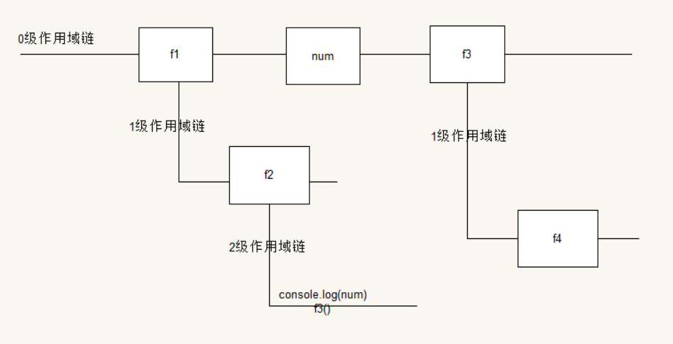

# js高级

# **异常处理**

## **常见的异常分类**

· 运行环境的多样性导致的异常（浏览器）

· 语法错误，代码错误

异常最大的特征，就是一旦代码出现异常，后面的代码就不会再执行

## **异常捕获**

捕获异常，使用try-catch语句

```js
try{

    //这里写可能出现异常的代码

}catch(e){

    //这里的e就是捕获的异常对象

    //可以在这里写，出现异常后的处理代码

}
```

异常捕获语句执行的过程为：

1. 代码正常运行, 如果在try中出现了错误, try 里面出现错误的语句后面的代码都不再执行, 直接跳转到 catch 中
2. catch中处理错误信息
3. 然后继续执行后面的代码
4. 如果 try 中没有出现错误, 那么不走 catch 直接执行后面的代码

通过try-catch语句进行异常捕获之后，代码将会继续执行，而不会中断。

**注意：**

· 语法错误异常用try-catch语句无法捕获，因为在预解析阶段，语法错误会直接检测出来，而不会等到运行的时候才报错。

· try-catch在一般日常开发中基本用不到，但是如果要写框架什么的，用的会非常多。因为这个会让框架变得健壮

## **抛出异常**

如何手动的抛出异常呢？

案例：自己写的一个函数，需要一个参数，如果用户不传参数，此时想直接给用户抛出异常，就需要了解如何抛出异常。

抛出异常使用throw关键字，语法如下：

throw 异常对象;

异常对象一般是用new Error("异常消息"), 也可以使用任意对象

```js
function test(para){

    if(para == undefined){

        throw new Error("请传递参数");

        //这里也可以使用自定义的对象

        throw {"id":1, msg:"参数未传递"};

    }

}

 

try{

    test();

}catch(e){

    console.log(e);

}
```


## **异常的传递机制**

```js
function f1 () {

    f2(); // f1 称为调用者, 或主调函数, f2 称为被调用者, 或被调函数

}

 

function f2 () {

    f3();

}

 

function f3() {

    throw new Error( 'error' );

}

f1();
```

当在被调函数内发生异常的时候，异常会一级一级往上抛出。

## **异常捕获语句的完整模式**

异常捕获语句的完整模式为try-catch-finally

```js
try {

    //可能出现错误的代码

} catch ( e ) {

    //如果出现错误就执行

} finally {

    //结束 try 这个代码块之前执行, 即最后执行

}
```

finally中的代码，不管有没有发生异常，都会执行。一般用在后端语言中，用来释放资源，JavaScript中很少会用到

# **面向对象**

# **面向对象的基本概念**

## **什么是面向对象编程？**

## **面向过程和面向对象的对比**

**Example 1：洗衣服**

面向过程的思维方式：

​    step 1:收拾脏衣服

​    step 2:打开洗衣机盖

​    step 3:将脏衣服放进去

​    step 4:设定洗衣程序

​    step 5:开始洗衣服

​    step 6:打开洗衣机盖子

​    step 7:晒衣服

 

面向对象的思维方式：

​    洗衣机需要什么对象？

​    女朋友    

​    洗衣机

在面向对象的思维方式中：我们只关心要完成事情需要的对象。

总结：面向对象是一种解决问题的思路，一种编程思想。

#### **对象是什么呢？**

万物皆对象

#### **JavaScript中的对象是什么？**

在JavaScript中，所谓的对象，就是键值对的集合。

**编写代码的时候的原则:DRY**

Don’t repeat yourself

#### **属性和方法是什么？**

比如要描述一个人，这个人有name,age,gender,体现在代码中：

```js
{ name:"张三", age:18, gender:"Male" }
```

比如要做一个学生管理系统，那学生就是要设计的对象，学生拥有name,age,gender,address,phone,体现在代码中：

```js
{ name:"刘亦菲", age:18, gender:"female", address:"上海", phone:"110" }
```


## **总结**

· 面向过程关注的实现功能的步骤，是如何把功能拆解后一步步的实现

· 面向对象则是关注的实现功能的一系列的对象

# **面向对象编程举例**

设置页面中的div和p的边框为1px solid red

## **传统的处理办法**

```js
// 任务需求:

// 1> 获取div标签

var divs = document.getElementsByTagName( 'div' );

// 2> 遍历获取到的div标签

for(var i = 0; i < divs.length; i++) {

    //3> 获取到每一个div元素,设置div的样式

    divs[i].style.border = "1px dotted black";

}

 

// 4> 获取p标签

var ps = document.getElementsByTagName("p");

// 5> 遍历获取到的p标签

for(var j = 0; j < ps.length; j++) { 

    // 获取到每一个div元素 设置p标签的样式

    ps[j].style.border = "1px dotted black"; 

}
```


## **使用函数进行封装优化**

```js
// 通过标签名字来获取页面中的元素 

function tag(tagName) { 

    // var dvs = document.getElementsByTagName(tagName); 

    // return dvs; 

    return document.getElementsByTagName(tagName); 

}

 

// 封装一个设置样式的函数 

function setStyle(arr) { 

    for(var i = 0; i < arr.length; i++) { 

        // 获取到每一个div元素 

        arr[i].style.border = "1px solid #abc"; 

    } 

}

var dvs = tag("div");

var ps = tag("p");

setStyle(dvs); 

setStyle(ps);
```


## **使用面向对象的方式**

```js
// 更好的做法：是将功能相近的代码放到一起 

var tools = { 

    getEle: { 

        tag: function (tagName) { 

            return document.getElementsByTagName(tagName); 

        }, 

        id: function (idName) { 

            return document.getElementById(idName); 

        } 

    },    

    setCss: { 

        setStyle: function (arr) { 

            for(var i = 0; i < arr.length; i++) { 

                arr[i].style.border = "1px solid #abc"; 

            } 

        }, 

        css: function() {}, 

        addClass: function() {}, 

        removeClass: function() {} 

        // ... 

    } 

    // 属性操作模块 

    // 动画模块 

    // 事件模块 

    // ... 

};

 

var divs = tools.getEle.tag();

tools.setCss.setStyle(divs);
```


# **构造函数的作用**

```js
function Person(name, age){

    this.name = name;

    this.age = age;

}

//断点调试，进行类型查看

var p1 = new Person();

var p2 = new Object();

var p3 = new Date();

var p4 = new RegExp();

var p5 = {};
```


## **1.构造函数是干什么用的？**

在JavaScript中，构造函数是给对象添加属性，初始化属性用的。

## **2. 对象的创建过程**

var p = new Person();

以上面这个p对象创建为例：

1. 首先使用new关键字创建对象，类似于使用{},这个时候创建出来的对象是一个"没有任何成员"的对象。这里需要注意两点：

o 使用new关键字创建的对象，对象的类型就是创建这个对象使用的构造函数的函数名

o 使用{}创建对象，对象的类型一定是Object，相当于使用了new Object()

2. 使用构造函数为其初始化成员

o 在构造函数调用开始的时候，有一个赋值操作，也就是让this = 刚创建出来的对象

o 在构造函数中，this就代表刚创建出来的对象

3. 在构造函数中，利用对象的动态特性，为对象添加成员

# **面向对象的特性**

JavaScript面向对象的特性

## **1. 封装性**

对象是将数据与功能组合到一起, 即封装

1. js 对象就是 键值对的集合

o 键值如果是数据( 基本数据, 复合数据, 空数据 ), 就称为属性

o 如果键值是函数, 那么就称为方法

2. 对象就是将属性与方法封装起来

3. 方法是将过程封装起来

## **2. 继承性**

所谓继承就是自己没有, 别人有,拿过来为自己所用, 并成为自己的东西

### **2.1. 传统继承基于模板**

子类可以使用从父类继承的属性和方法。

```js
class Person {

 string name;

 int age;

}

 

class Student : Person {

}

var stu = new Student();

stu.name
```

即：让某个类型的对象获得另一个类型的对象的属性的方法

### **2.2. js 继承基于对象**

在JavaScript中，继承就是当前对象可以使用其他对象的方法和属性。

js继承实现举例：混入（mix）

```js
function mix ( o1, o2 ) {

    for ( var k in o2 ) {

        o1[ k ] = o2[ k ];

    }

}
```


## 3. 多态性（基于强类型）只做了解

把不同的子类对象都当作父类来看，可以屏蔽不同子类对象之间的差异，写出通用的代码，做出通用的编程，以适应需求的不断变化。

动物 animal = new 子类(); // 子类：麻雀、狗、猫、猪、狐狸...

动物 animal = new 狗();

animal.叫();

 

# **原型**

# **传统构造函数存在的问题**

## **1. 发现问题**

现有构造函数如下：

```js
function Person(name, age){

    this.name = name;

    this.age = age;

    this.sayHi = function(){

        console.log("你好");

    }

}
```

调用该构造函数创建对象，并对比创建出来的对象的sayHi方法：

 

```js
var p = new Person("张三", 18);

var p1 = new Person("李四", 19);

console.log(p.sayHi == p1.sayHi); //输出结果为false
```

由于每个对象都是由new Person创建出来的，因此每创建一个对象，函数sayHi都会被重新创建一次，这个时候，每个对象都拥有一个独立的，但是功能完全相同的方法。

 

**功能相同的函数，完全没有必要再内存中存在这么多份。所以就造成了资源浪费。**

## **2. 解决问题**

这里最好的办法就是将函数体放在构造函数之外. 在构造函数中只需要引用该函数即可。

```js
function sayHello(){

    console.log("你好");

}

 

function Person(name, age){

    this.name = name;

    this.age = age;

    this.sayHi = sayHello;

}

 

//调用该构造函数创建对象，并对比创建出来的对象的sayHi方法

var p = new Person("张三", 18);

var p1 = new Person("李四", 19);

console.log(p.sayHi == p1.sayHi); //输出结果为true
```

**这样写依然存在问题：**

· 全局变量增多，会增加引入框架命名冲突的风险

· 代码结构混乱，会变得难以维护

# **使用原型解决构造函数问题**

## **1. 关键点**

· 每一个函数在定义的时候，都会有跟它关联的一个对象被创建出来

· 每一个由构造函数创建出来的对象，都会默认的和构造函数的神秘对象关联

· 当使用一个方法进行属性或者方法访问的时候，会先在当前对象内查找该属性和方法

· 如果当前对象内未找到，就回去跟它关联的神秘对象内进行查找

```js
function Person(name, age){

    this.name = name;

    this.age = age;

    this.sayHi = function(){

        console.log("Hello!");

    };

}

 

var p = new Person("张三", 18);

p.sayHi(); //当前对象内有这个方法，所以不会去神秘对象内进行查找

var p1 = new Person("李四", 19);

p1.sayHello(); //当前对象没没有找到这个方法，所以去神秘对象内进行查找

问题来了，如何访问到这个神秘对象呢？

 

//可以通过 构造函数.prototype 访问这个神秘对象

console.log(Person.prototype);

当尝试给这个对象新增一个方法之后:

Person.prototype.sayHello = function(){

    console.log("我是神秘对象中的方法");

};

使用p,p1都可以访问这个方法：

p.sayHello();

p1.sayHello();
```

**总结：**

所有对象共享神秘对象(构造函数.prototype)内的属性和方法。

## **2. 解决方案**

既然所有对象共享神秘对象(构造函数.prototype)内的属性和方法。我们只需要将需要共享的东西，也就是重复占用内存的东西，全部都放到 神秘对象(构造函数.prototype)中，那么所有对象就都可以使用，并且内存里面也只有一份了。

**改造构造函数**

```js
function Person(name, age){

    this.name = name;

    this.age = age;

}

 

Person.prototype.sayHi = function(){

    console.log("你好");

};

 

//测试

var p = new Person("张三", 18);

var p1 = new Person("李四", 19);

 

console.log(p.sayHi == p1.sayHi); //输出true
```


## **3.常见的错误**

### **3.1. 将属性写在神秘对象（构造函数.prototype）内**

```js
function Car(name){

     this.name = name;

}

 

function Person() {}

 

Person.prototype.name = '张三'; //基本类型的属性影响不大

 

Person.prototype.car = new Car("法拉利"); //引用类型的属性，会被所有的对象共享

 

var p = new Person();
```


### **3.2. 赋值的错误**

 

```js
function Person() {}

 

Person.prototype.name = '张三';

 

var p1 = new Person();

 

var p2 = new Person();

 

p1.name = '李四';

 

console.log( p1.name );

 

console.log( p2.name );

 

// 如果是访问数据, 当前对象中如果没有该数据就到构造函数的原型属性中去找

 

// 如果是写数据, 当对象中有该数据的时候, 就是修改值; 如果对象没有该数据, 那么就添加值
```


# **原型相关的概念**

## **1. 神秘对象与构造函数**

· 神秘对象就是构造函数的 "原型属性"

· 简称原型 (构造函数的原型)

## **2. 神秘对象与构造函数所创建出来的对象**

· 神秘对象针对构造函数创建出来的对象称为 "原型对象"

· 简称原型 (对象的原型）

 

## **4.** **原型继承**

 

o 原型中的成员, 可以直接被实例对象所使用

o 实例对象直接 "含有" 原型中的成员

o 因此实例对象 继承自 原型

o 这样的继承就是 "原型继承"

# **原型的使用**

## **1. 使用对象的动态特性**

```js
function Person () { }

Person.prototype.func = function () {

 console.log( 'something' );

};

var p = new Person();

p.func();
```


## **2. 直接替换原型对象**

 

```js
function Person () { };

Person.prototype = {

    func: function () {

        console.log( '22222' );

    }

};

var p = new Person();

p.func();
```


## **3. 直接替换原型会出现的问题**

 

```js
function Person () { }

 

Person.prototype.func = function () {

    console.log( 'something' );

};

 

var p = new Person();

 

Person.prototype.func = function () {

    console.log( 'something' );

};

 

var p1 = new Person();

 

p.func();

p1.func();
```

**替换原型之后，在替换前创建出来的对象和替换后创建出来的对象的原型对象不一致**

# **对象的**__proto__**属性**

## **1、标识符命名规则**

· 区分大小写,Name和name是两个不同的变量

· 标识符可以以下划线_,美元符$或者字母开头，但是不能是数字

· 标识符可以由下划线_，美元符$，字母，数字组成

## **2.神秘对象的访问**

### **构造函数的**prototype**属性**

```js
之前我们访问神秘对象的时候，使用的是原型属性prototype

function Person(){}

 

//通过构造函数的原型属性prototype可以直接访问原型

 

Person.prototype;

在之前是无法通过构造函数创建出来的对象访问原型的

 

function Person(){}

 

var p = new Person();

 

//以前不能直接通过p来访问神秘对象
```


### **实例对象的**__proto__**属性**

__proto__属性最早是火狐浏览器引入的，用以通过实例对象来访问原型，这个属性在早期是非标准的属性

有了__proto__属性，就可以通过构造函数创建出来的对象直接访问神秘对象

 

```js
function Person(){}

 

var p = new Person();

 

//实例对象的__proto__属性可以方便的访问到原型对象

 

p.__proto__;

 

//既然使用构造函数的`prototype`和实例对象的`__proto__`属性

//都可以访问原型对象

//就有如下结论

p.__proto__ === Person.prototype;
```


## **3.**__proto__**属性的用途**

· 可以用来访问原型

· 在实际开发中除非有特殊的需求，不要轻易的使用实例对象的__proto__属性去修改原型的成员，

· 在调试过程中，可以轻易的查看原型的成员

tips:

早期如何通过实例对象访问原型？

可以使用实例对象访问构造函数属性constuctor

```js
var p = new Person();

p.constructor.prototype;
```

## 4.给实例继承自原型的属性赋值需要注意的问题

```js
function Person(){};

Person.prototype.name = "周华健";

var o1 = new Person();

var o2 = new Person();

o1.name = "李宗盛"; //这里修改的不是原型对象的name属性，而是给o1自己新增了一个name属性，进行了赋值

 

//我们可以对比一下o1和o2的name值

console.log(o1.name , o2.name);
```


## **继承的实现方式**

通过继承来让dog对象可以使用animal对象的属性和方法，那怎么实现继承呢？

### **1. 最简单的继承实现**

**直接遍历父对象的属性，将所有的属性加到当前对象上**

```js
var animal = {

    name:"Animal",

    sex:"male",

    age:5,

    bark:function(){

        console.log("Animal bark");

    }

};

 

var dog = {};

for (var k in animal){

    dog[k]= animal[k];

}
```


### **2. 原型继承**

每一个构造函数都有prototype原型属性，通过构造函数创建出来的对象都继承自该原型属性。所以可以通过更改构造函数的原型属性来实现继承。

```js
function Dog(){

    this.type = "yellow Dog";

}

 

function extend(obj1, obj2){

    for (var k in obj2){

        obj1[k] = obj2[k];    

    }

};

 

//使用混入的方式，将属性和方法添加到构造函数的原型属性上，构造函数所创建出来的实例就都有了这些属性和方法。

extend(Dog.prototype, {

    name:"",

    age:"",

    sex:"",

    bark:function(){}

 

})

 

//使用面向对象的思想把extend方法重新封装

//extend是扩展的意思，谁要扩展就主动调用extend这个方法

//所以extend应该是对象的方法，那现在我们要扩展的是构造函数的原型对象

//所以给构造函数的原型对象添加一个extend方法

 

//如下：

 

Dog.prototype.extend = function(obj){

    for (var k in obj){

        this[k]=obj[k];

    }

}

 

//调用方式就变成了下面这种形式

 

Dog.prototype.extend({

    name:"",

    age:"",

    sex:"",

    bark:function(){}

});
```


## **属性搜索原则**

访问一个对象的成员的时候，首先是在实例中找，没有找到, 就去原型中找, 但是原型中没有怎么办?

### **原型链**

每一个对象都有原型属性，那么对象的原型属性也会有原型属性，所以这样就形成了一个链式结构，我们称之为原型链。

## **属性搜索原则**

所谓的属性搜索原则，也就是属性的查找顺序，在访问对象的成员的时候，会遵循如下的原则:

1. 首先在当前对象中查找，如果找到，停止查找，直接使用，如果没有找到，继续下一步

2. 在该对象的原型中查找，如果找到，停止查找，直接使用，如果没有找到，继续下一步

3. 在该对象的原型的原型中查找，如果找到，停止查找，直接使用，如果没有找到，继续下一步。

4. 继续往上查找，直到查找到Object.prototype还没有, 那么是属性就返回 undefied，是方法，就报错xxx is not a function。

## **原型链结构**

凡是对象就有原型, 原型又是对象, 因此凡是给定义一个对象, 那么就可以找到他的原型, 原型还有原型. 那么如此下去, 就构成一个对象的序列. 称该结构为原型链.

使用构造函数创建出对象, 并且没有利用赋值的方式修改原型, 就说该对象保留默认的原型链.

默认原型链结构是什么样子呢?

```js
function Person() {

}

 

var p = new Person();

// p 具有默认的原型链
```

默认的原型链结构就是:

当前对象 -> 构造函数.prototype -> Object.prototype -> null

在实现继承的时候, 有时会利用替换原型链结构的方式实现原型继承, 那么原型链结构就会发生改变

 

```js
function ToolsCollection () {

}

ToolsCollection.prototype = [];

var arr = new ToolsCollection();

// arr -> [] -> Array.prototype -> Object.prototype -> null

// var arr = new Array();
```


## **原型式继承**

观察：DOM对象的原型链

原型式继承就是利用修改原型链的结构( 增加一个节点, 删除一个节点, 修改节点中的成员 ), 来使得实例对象可以使用整条链中的所有成员.

## **绘制原型链结构**

**注意**：函数也有__proto__属性，暂时不考虑这个！

观察如下代码，绘制相应的原型链结构图:

```js
function Person(){};

var p = new Person();
```

**注意**：

在 js 中, 所有的对象字面量在解析以后, 就是一个具体的对象了. 那么可以理解为 调用的 对应的构造方法.

· 例如在代码中写上 {}, 就相当于new Object()

· 例如代码中有 [], 就相当于new Array()

· 例如代码中有 /./, 就相当于new RegExp( '.' )

注意: 在底层理论执行的过程中, 是否有调用构造函数, 不一定. 和浏览器的版本有关.

# **对象相关的其他知识**

## **Object.prototype成员介绍**

### Object.prototype**常用成员**

| **成员**                          | **描述**                                                     |
| --------------------------------- | ------------------------------------------------------------ |
| Object.prototype.__proto__        | 指向当对象被实例化的时候，用作原型的对象。                   |
| Object.prototype.hasOwnProperty() | 返回一个布尔值 ，表示某个对象是否含有指定的属性，而且此属性非原型链继承的。 |
| Object.prototype.isPrototypeOf()  | 返回一个布尔值，表示指定的对象是否在本对象的原型链中。       |
|                                   |                                                              |
| Object.prototype.toString()       | 返回对象的字符串表示。                                       |
| Object.prototype.valueOf()        | 返回指定对象的原始值。                                       |

## **函数的构造函数Function**

在 js 中 使用Function可以实例化函数对象。也就是说在 js 中函数与普通对象一样, 也是一个对象类型. 函数是 js 中的一等公民.

1. 函数是对象, 就可以使用对象的动态特性

2. 函数是对象, 就有构造函数创建函数

3. 函数是函数, 可以创建其他对象

4. 函数是唯一可以限定变量作用域的结构

要解决的问题

1. Function 如何使用

2. Function 与函数的关系

3. 函数的原型链结构

## **Function 的使用**

### **语法:**

Function函数所有的参数全都是字符串

Function函数的作用就是将所有的参数组合起来，变成一个函数

1、如果只传一个参数，那么这个函数必然是函数体

2、如果传多个参数，那么最后一个参数表示函数体，前面的参数代表将要创建的函数的参数

3、如果不传参数，表示创建一个空函数

new Function(arg1, arg2, arg3, ..., argN, body);

### **创建一个打印一句话的函数**

```js
//传统的方式

function foo(){

    console.log("你好");

}

 

//使用Function

var func = new Function("console.log('你好');");

这里两种方式创建出来的函数功能是一样的。
```


### **创建一个空函数**

```js
//传统的方式

function foo(){}

 

//Function

var func = new Function();
```


### **创建一个有参数的函数**

```js
//传统的方式

function foo(num){

    console.log(num);

}

 

//Function

 

var func = new Function("num", "console.log(num);");
```


## **解决代码太长的问题**

利用+连接字符串

 

```js
var func = new Function( 'a', 'b', 'c',

 

 'var res = a > b ? a : b;' +

 

 'res = res > c ? res : c;' +

 

 'return res;' );

 

利用字符串特性

 

function foo ( a, b, c ) {

    var res = a > b ? a : b;

    res = res > c ? res : c;

    return res;

}

var func = new Function( 'a', 'b', 'c', 'return foo( a, b, c );');
```

1. ES6 语法（很少有浏览器实现） 使用键盘左上角的`表示可换行字符串的界定符，之前我们用的是单引号或者双引号来表示一个字符串字面量，在ES6中可以用反引号来表示该字符串可换行。

2. (最终)利用 DOM 的特性完成该方法

<div id="code" style="display:none">

```html
var res = a > b ? a : b;

res = res > c ? res : c;

return res;

</div>

 

<script>

 

var txt = document.getElementbyId("code).innerHtml + ' ';

 

var func = new Function('a', 'b', 'c', txt);

 

</script>
```


## **静态成员与实例成员的概念**

静态成员和实例成员这两个概念其实也是从面相对象的编程语言中引入的，对应到JavaScript中的理解为：

### **静态成员**

静态成员是指**静态属性**和**静态方法**，所谓静态，就是由构造函数提供的。

### **实例成员**

实例成员是值**实例属性**和**实例方法**，所谓实例，就是由构造函数创建出来的对象。

### **举例说明：**

 

```js
function Person(){

    this.name = "zs",

    this.sayHello = function(){

        console.log("Hello World");

    }

}

 

//下面这个sayHi方法就是构造函数自己的方法，也就是静态方法

Person.sayHi = function(){

    console.log("I'm a Person");

}

 

//原型属性属于构造函数，所以原型属性是静态属性

Person.prototype = {};

var p = new Person();

 

//这里的name是构造函数创建出来的实例对象的属性，所以是实例属性

p.name = "李四";

 

//这里的sayHello也是构造函数创建出来的实例对象的方法，所以是实例方法

p.sayHello();
```


### **提示：**

一般工具型方法都有静态成员提供, 一般与实例对象有关的方法由实例成员表示.

工具方法：比如jQuery.Ajax()、jQuery.trim()、jQuery.Each()

## **arguments对象**

在每一个函数调用的过程中, 函数代码体内有一个默认的对象arguments, 它存储着实际传入的所有参数。

arguments是一个伪数组对象. 它表示在函数调用的过程中传入的所有参数的集合。在函数调用过程中不规定参数的个数与类型, 可以使得函数调用变得非常灵活性。

JavaScript中的函数并没有规定必须如何传参：

1. 定义函数的时候不写参数, 一样可以调用时传递参数

2. 定义的时候写了参数, 调用的时候可以不传参

3. 定义的时候写了一个参数, 调用的时候可以随意的传递多个而参数

在代码设计中, 如果需要函数带有任意个参数的时候, 一般就不带任何参数, 所有的参数利用arguments对象来获取.

 **作用域**

**域**，表示的是一个范围，**作用域**，就是作用范围。

作用域说明的是一个变量可以在什么地方被使用，什么地方不能被使用。

### **块级作用域**

JavaScript中没有块级作用域

```js
{

    var num = 123;

    {

        console.log( num );

    }

}

console.log( num );
```

上面这段代码在JavaScript中是不会报错的，但是在其他的编程语言中（C#、C、JAVA）会报错。

这是因为，在JavaScript中没有块级作用域，使用{}标记出来的代码块中声明的变量num，是可以被{}外面访问到的。

但是在其他的编程语言中，有块级作用域，那么{}中声明的变量num，是不能在代码块外部访问的，所以报错。

### **词法作用域**

**什么是词法作用域？**

词法( 代码 )作用域, 就是代码在编写过程中体现出来的作用范围. 代码一旦写好, 不用执行, 作用范围就已经确定好了. 这个就是所谓词法作用域.

**在 js 中词法作用域规则:**

· 函数允许访问函数外的数据.

· 整个代码结构中只有函数可以限定作用域.

· 作用域规则首先使用提升规则分析

· 如果当前作用规则中有名字了, 就不考虑外面的名字

#### **练习：**

```js
var num = 123;

function foo() {

    console.log( num );

}foo();

2.

if ( false ) {

    var num = 123;

} 

console.log( num ); 

3.

var num = 123;

function foo() {

    var num = 456;

    function func() {

        console.log( num );

    }

    func();

}

foo();

4.

var num1 = 123;

function foo1() {

    var num1 = 456;

    function foo2() {

        num1 = 789;

        function foo3 () {

            console.log( num1 );

        }

        foo3();

    }

    foo2();

}

foo1();

console.log( num1 );
```


#### **面试题**

```js
var num = 123;

function func1(){

    console.log(num);

}

function func2(){

    var num = 456;

    func1();

}

func1()

func2();
```

 

JavaScript是解释型的语言，但是他并不是真的在运行的时候逐句的往下解析执行。

我们来看下面这个例子：

```js
func();

 

function func(){

     alert("Funciton has been called");

}
```

在上面这段代码中，函数func的调用是在其声明之前，如果说JavaScript代码真的是逐句的解析执行，那么在第一句调用的时候就会出错，然而事实并非如此，上面的代码可以正常执行，并且alert出来Function has been called。

**所以，可以得出结论，JavaScript并非仅在运行时简简单单的逐句解析执行！**

## **JavaScript 预解析**

JavaScript引擎在对JavaScript代码进行解释执行之前，会对JavaScript代码进行预解析，在预解析阶段，会将以关键字var和function开头的语句块提前进行处理。

*关键问题是怎么处理呢？*

当变量和函数的声明处在作用域比较靠后的位置的时候，变量和函数的声明会被提升到作用域的开头。

重新来看上面的那段代码

```js
func();

function func(){

     alert("Funciton has been called");

}

由于JavaScript的预解析机制，上面的代码就等效于：

function func(){

    alert("Funciton has been called");

}

func();

看完函数声明的提升，再来看一个变量声明提升的例子：

alert(a);

var a = 1;
```

由于JavaScript的预解析机制，上面这段代码，alert出来的值是undefined，如果没有预解析，代码应该会直接报错a is not defined，而不是输出值。

Wait a minute, 不是说要提前的吗？那不是应该alert出来1，为什么是undefined?

那么在这里有必要说一下声明、定义、初始化的区别。其实这几个概念是C系语言的人应该都比较了解的。

 

| **行为** | **说明**                                                     |
| -------- | ------------------------------------------------------------ |
| 声明     | 告诉编译器/解析器有这个变量存在,这个行为是不分配内存空间的,在JavaScript中，声明一个变量的操作为：var a; |
| 定义     | 为变量分配内存空间，在C语言中，一般声明就包含了定义，比如：int a;,但是在JavaScript中，var a;这种形式就只是声明了。 |
| 初始化   | 在定义变量之后，系统为变量分配的空间内存储的值是不确定的，所以需要对这个空间进行初始化，以确保程序的安全性和确定性 |
| 赋值     | 赋值就是变量在分配空间之后的某个时间里，对变量的值进行的刷新操作（修改存储空间内的数据) |

 

所以我们说的提升，是**声明**的提升。

那么再回过头看，上面的代码就等效于：

var a; //这里是声明

alert(a);//变量声明之后并未有初始化和赋值操作，所以这里是 undefined

a = 1;

## **复杂点的情况分析**

通过上一小节的内容，我们对变量、函数声明提升已经有了一个最基本的理解。那么接下来，我们就来分析一些略复杂的情况。

### **函数同名**

观察下面这段代码:

```js
func1();

function func1(){

     console.log('This is func1');

}

 

func1();

function func1(){

     console.log('This is last func1');

}

输出结果为：

This is last func1

This is last func1

原因分析：由于预解析机制，func1的声明会被提升，提升之后的代码为：

function func1(){

     console.log('This is func1');

}

 

function func1(){

     console.log('This is last func1');

}

 

func1();

func1();
```

同名的函数，后面的会覆盖前面的，所以两次输出结果都是This is last func1。

### **变量和函数同名**

```js
alert(foo);

function foo(){}

var foo = 2;

当出现变量声明和函数同名的时候，只会对函数声明进行提升，变量会被忽略。所以上面的代码的输出结果为

function foo(){}

我们还是来吧预解析之后的代码展现出来:

function foo(){};

alert(foo);

foo = 2;

再来看一种

var num = 1;

function num () {

     alert( num );

}

num();

代码执行结果为：

Uncaught TypeError: num is not a function

 

 

直接上预解析后的代码：

function num(){

     alert(num);

}

 

num = 1;

num();
```


## **预解析是分作用域的**

声明提升并不是将所有的声明都提升到window对象下面，提升原则是提升到变量运行的环境(作用域)中去。

```js
function showMsg()

{

    var msg = 'This is message';

}

alert(msg); // msg未定义

还是直接把预解析之后的代码写出来：

function showMsg()

{

    var msg;

    msg = 'This is message';

}

alert(msg); // msg未定义
```


## **预解析是分段的**

分段，其实就分script标签的

```html


<script>

func();

function func(){

    console.log('AA1');

}

function func(){

    console.log('AA2');

}

</script>

 

<script>

function func(){

    console.log('AA3');

}

</script>
```

第一个script标签中的两个func进行了提升，第二个func覆盖了第一个func，但是第二个script标签中的func并没有覆盖上面的第二个func。所以说预解析是分段的。

## **函数表达式并不会被提升**

```js
func();

var func = function(){

    alert("我被提升了");

};

这里会直接报错，func is not a function，原因就是函数表达式，并不会被提升。只是简单地当做变量声明进行了处理，如下：

var func;

func();

func = function(){

    alert("我被提升了");

}
```


## **条件式函数声明**

```js
console.log(typeof func);

if(true){

    function func(){

        return 1;

    }

}

console.log(typeof func);
```

上面这段代码，就是所谓的条件式函数声明，这段代码在Gecko引擎中打印"undefined"、

Gecko加入了ECMAScript以外的一个feature：条件式函数声明。

Conditionally created functions Functions can be conditionally declared, that is, a function declaration can be nested within an if statement.

Note: Although this kind of function looks like a function declaration, it is actually an expression (or statement), since it is nested within another statement. See differences between function declarations and function expressions.

Note中的文字说明，条件式函数声明的处理和函数表达式的处理方式一样，所以条件式函数声明没有声明提升的特性。

## **作用域链**

### **什么是作用域链**

只有函数可以制造作用域结构， 那么只要是代码，就至少有一个作用域, 即全局作用域。

凡是代码中有函数，那么这个函数就构成另一个作用域。如果函数中还有函数，那么在这个作用域中就又可以诞生一个作用域。

将这样的所有的作用域列出来，可以有一个结构: 函数内指向函数外的链式结构。就称作作用域链。

**例如：**

​    

```js
//f1--->全局

    function f1(){

        //f2--->f1--->全局

        function f2(){

            //f3---->f2--->f1--->全局

            function f3(){

            }

            //f4--->f2--->f1---->全局

            function f4(){

            }

        }

        //f5--->f1---->全局

        function f5(){

        }

    }
```



### **绘制作用域链的步骤:**

1. 看整个全局是一条链, 即顶级链, 记为 0 级链

2. 看全局作用域中, 有什么成员声明, 就以方格的形式绘制到 0 级练上

3. 再找函数, 只有函数可以限制作用域, 因此从函数中引入新链, 标记为 1 级链

4. 然后在每一个 1 级链中再次往复刚才的行为

### **变量的访问规则**

· 首先看变量在第几条链上, 在该链上看是否有变量的定义与赋值, 如果有直接使用

· 如果没有到上一级链上找( n - 1 级链 ), 如果有直接用, 停止继续查找.

· 如果还没有再次往上刚找... 直到全局链( 0 级 ), 还没有就是 is not defined

· 注意,同级的链不可混合查找

### **如何分析代码**

1. 在分析代码的时候切记从代码的运行进度上来分析, 如果代码给变量赋值了, 一定要标记到图中

2. 如果代码比较复杂, 可以在图中描述代码的内容, 有事甚至需要将原型图与作用域图合并分析

### **补充**

声明变量使用`var`, 如果不使用`var`声明的变量就是全局变量( 禁用 )

因为在任何代码结构中都可以使用该语法. 那么再代码维护的时候会有问题. 所以除非特殊原因不要这么用.

下面的代码的错误

```js
function foo () {

    var i1 = 1 // 局部

    i2 = 2, // 全局

    i3 = 3; // 全局

}
```


## **闭包**

### **闭包的概念**

闭包从字面意思理解就是闭合, 包起来.

简单的来说闭包就是,**一个具有封闭的对外不公开的, 包裹结构, 或空间.**

在JavaScript中函数可以构成闭包. 一般函数是一个代码结构的封闭结构, 即包裹的特性, 同时根据作用域规则, 只允许函数访问外部的数据, 外部无法访问函数内部的数据, 即封闭的对外不公开的特性. 因此说函数可以构成闭包.

### **闭包要解决什么问题？**

1. 闭包内的数据不允许外界访问

2. 要解决的问题就是间接访问该数据

**函数就可以构成闭包, 要解决的问题就是访问到函数内部的数据**

我们观察下面的函数foo，在foo内部有一个变量num，能否在函数外部访问到这个变量num呢？

```js
function foo () {

    var num = 123;

    return num;

}

 

var res = foo();

console.log( res ); // => 123
```

分析：

在上面的代码中，确实可以访问到num这个函数内部的变量。但是能不能多次访问呢？

不能，因为每次访问都得重新调用一次foo函数，每次调用都会重新创建一个num = 123，然后返回。

#### **解决思路**

函数内的数据不能直接在函数外被访问，是因为作用域的关系，上级作用域不能直接访问下级作用域中的数据。

但是如果反过来，下级作用域可以直接访问上级作用域中的数据。那么如果在函数foo内定义一个函数，那么在这个内部函数中是可以直接访问foo中的num的。

```js
function foo() {

    var num = Math.random();    

    function func() {

        return num;    

    }

    return func;

}

 

var f = foo();

// f可以直接访问num，而且多次访问，访问的也是同一个，并不会返回新的num

var res1 = f();

var res2 = f();
```


### **如何获得超过一个数据**

函数的返回值只能有一个，那按照上面的方法，我们只能对函数内部的一个数据进行操作。怎么操作函数内的多个数据呢？

可以使用对象，代码如下：

```js
function foo () {

    var num1 = Math.random();

    var num2 = Math.random();

    //可以将多个函数包含在一个对象内进行返回，这样就能在函数外部操作当前函数内的多个变量

    return {

        num1: function () {

            return num1;

        },

        num2: function () {

            return num2;

        }

    }

}
```


### **如何完成读取一个数据和修改这个数据**

使用内部的函数进行操作。

```js
function foo() {

    var num = Math.random();

    //分别定义get和set函数，使用对象进行返回

    return {

        //get_num负责获取数据

        get_num: function() {    

            return num;

        },

        //set_num负责设置数据

        set_num: function(value) {

            num = value;

        }

    }

}
```


### **闭包的基本结构**

**一般闭包要解决的的问题就是要想办法间接的获得函数内数据的使用权. 那么我们的可以总结出一个基本的使用模型.**

1. 写一个函数, 函数内定义一个新函数, 返回新函数, 用新函数获得函数内的数据

2. 写一个函数, 函数内定义一个对象, 对象中绑定多个函数, 返回对象, 利用对象的方法访问函数内的数据

## **函数模式**

**特征:**就是一个简单的函数调用，函数名前面没有任何的引导内容

```js
function foo(){}

var func = function(){}

foo();

func();

(function(){})();

this在函数模式中的含义： this在函数中表示全局对象，在浏览器中是window对象
```


## **方法模式**

**特征:** 方法一定是依附于一个对象, 将函数赋值给对象的一个属性, 那么就成为了方法.

```js
function f() {

    this.method = function () {};

}

 

var o = {

    method: function () {}

}
```

this在方法模式调用中的含义:表示函数所依附的这个对象

## **构造器调用模式**

由于构造函数只是给 this 添加成员. 没有做其他事情. 而方法也可以完成这个操作, 就 this 而言, 构造函数与方法没有本质区别.

**特征:**使用 new 关键字, 来引导构造函数.

```js
function Person(){

    this.name = "zhangsan";

    this.age = 19;

    this.sayHello = function(){

    };

}

var p = new Person();
```

构造函数中this与方法中一样, 表示对象, 但是构造函数中的对象是刚刚创建出来的对象

### **关于构造函数中**return**关键字的补充说明**

· 构造函数中不需要return, 就会默认的return this

· 如果手动的添加return, 就相当于 return this

· 如果手动的添加return 基本类型; 无效, 还是保留原来 返回this

· 如果手动添加return null; 或return undefiend, 无效

· 如果手动添加return 对象类型; 那么原来创建的this就会被丢掉, 返回的是 return后面的对象

### **创建对象的模式**

#### **工厂方法**

```js
// 工厂就是用来生产的, 因此如果函数创建对象并返回, 就称该函数为工厂函数

function createPerson( name, age, gender ) {

    var o = {};

    o.name = name;

    o.age = age;

    o.gender = gender;

    return o;

}

// document.createElement()
```


#### **构造方法**

```js
function Person(name, age, gender){

    this.name = name;

    this.age = age;

    this.gender = gender;

}

 

var p = new Person("zhangsan", 19, "男");
```


#### **寄生式创建对象**

 

```js
function Person(name, age, gender){

    var o = {};

    o.name = name;

    o.age = age;

    o.gender = gender;

    return o;

}

 

var p = new Person("Jack", 18, "male");
```


#### **混合式创建**

混合式继承就是将所有的属性放在构造方法里面，然后将所有的方法放在原型里面，使用构造方法和原型配合起来创建对象。(模仿着前面的,自己试一试)

## **上下文调用模式**

上下文(Context)，就是函数调用所处的环境。

上下文调用，也就是自定义设置this的含义。

在其他三种调用模式中，函数在调用的时候，this的值都是指定好了的，我们没办法自己进行设置，如果尝试去给this赋值，会报错。

 

### **上下文调用的语法**

 

//第一种， apply

 

函数名.apply(对象, [参数]);

 

//第二种， call

 

函数名.call(对象, 参数);

 

//上面两种方式的功能一模一样，只是在传递参数的时候有差异。

**功能描述：**

1. 语法中的函数名表示的就是函数本身，使用函数调用模式的时候，this默认是全局对象

2. 语法中的函数名也可以是方法(如:obj.method)，在使用方法模式调用的时候，this默认是指当前对象

3. 在使用apply和call的时候，默认的this都会失效，this的值由apply和call的第一个参数决定

**补充说明**

1. 如果函数或方法中没有this的操作, 那么无论什么调用其实都一样.

2. 如果是函数调用foo(), 那么有点像foo.apply( window ).

3. 如果是方法调用o.method(), 那么有点像o.method.apply( o ).

### **参数问题**

call和apply在没有后面的参数的情况下(函数无参数, 方法无参数) 是完全一样的.

如下：

```js
function foo() {

     console.log( this );

}

 

foo.apply( obj );

foo.call( obj );
```

**第一个参数的使用规则:**

1. 如果传入的是一个对象, 那么就相当于设置该函数中的 this 为参数

2. 如果不传入参数, 或传入 null. undefiend 等, 那么相当于 this 默认为 window

```js
foo();

foo.apply();

foo.apply( null );

foo.call( undefined );
```

 

3. 如果传入的是基本类型, 那么 this 就是基本类型对应的包装类型的引用

o number -> Number

o boolean -> Boolean

o string -> String

**第二个参数的使用规则**

在使用上下文调用的时候, 原函数可能会带有参数, 那么这个参数在上下文调用中使用第二个( 第 n 个 )参数来表示

```js
function foo( num ) {

     console.log( num );

}

 

foo.apply( null, [ 123 ] );

// 等价于

foo( 123 );
```


### **上下文调用模式的应用**

上下文调用只是能修改this, 但是使用的最多的地方是函数借用.

#### **1. 将伪数组转换为数组**

传统的做法：

```js
var a = {};

a[ 0 ] = 'a';

a[ 1 ] = 'b';

a.length = 2;

 

// 使用数组自带的方法 concat

// 如果参数中有数组会把参数数组展开

// 语法: arr.concat( 1, 2, 3, [ 4, [ 5 ] ] );

// 特点：不修改原数组

var arr = [];

var newArr = arr.concat( a );
```

由于a是伪数组, 只是长得像数组. 所以上面的代码不能成功，不能使用concat方法。

但是apply方法有一个特性, 可以将数组或伪数组作为参数。（IE8不支持伪数组操作）

foo.apply( obj, 伪数组 ); // IE8 不支持

利用apply方法，可以写出以下

```js
//将伪数组 a 作为 apply 的第二个参数

var newArr = Array.prototype.concat.apply( [], a )
```

处理数组转换, 实际上就是将元素一个一个的取出来构成一个新数组, 凡是涉及到该操作的方法理论上都可以。

##### **push方法**

```js
//用法:

arr.push( 1 ); //将这个元素加到数组中, 并返回所加元素的个数

arr.push( 1, 2, 3 ); //将这三个元素依次加到数组中, 返回所加个数

 

var a = { length: 0 }; // 伪数组

a[ a.length++ ] = 'abc'; // a[ 0 ] = 'abc'; a.length++;

a[ a.length++ ] = 'def';

 

// 使用一个空数组, 将元素一个个放到数组中即可

var arr = [];

arr.push( a ); // 此时不会将元素展开, 而是将这个伪数组作为一个元素加到数组中

// 再次利用 apply 可以展开伪数组的特征

arr.push.apply( arr, a );

// 利用 apply 可以展开伪数组的特性, 这里就相当于 arr.push( a[0], a[1] )
```


#### **2. 求数组中的最大值**

传统的做法

```js
var max = arr[ 0 ];

for ( var i = 1; i < arr.length; i++ ) {

    if ( arr[ i ] > max ) {

        ...

    }

}
```

在 js 中的Math对象中提供了很多数学函数Math.max( 1,2,3 )

还是利用 apply 可以展开数组的特性

```js
var arr = [ 123456,12345,1234,345345,234,5 ];

Math.max.apply( null, arr );
```


#### **3.借用构造函数继承**

```js
function Person ( name, age, gender ) {

    this.name = name;

    this.age = age;

    this.gender = gender;

}

// 需要提供一个 Student 的构造函数创建学生对象

// 学生也应该有 name, age, gender, 同时还需要有 course 课程

function Student ( name, age, gender, course ) {

    Person.call( this, name, age, gender );

    this.course = course;

}
```

